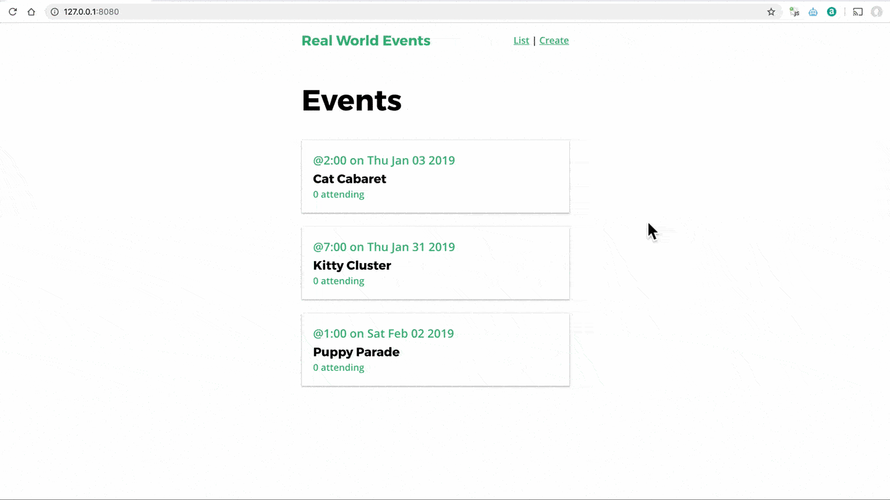
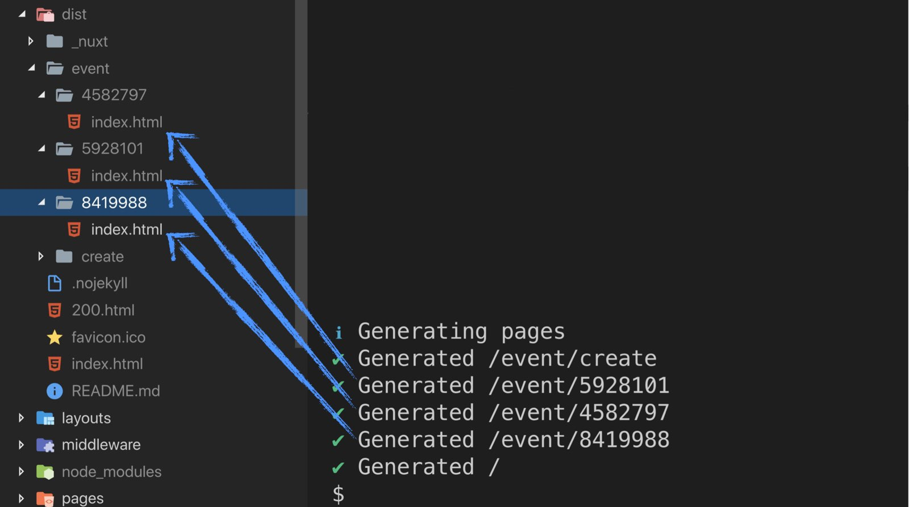

<link rel="stylesheet" href="assets/style.css" type="text/css" />
# 10. 部署生成的靜態網站

在這個章節，我們會更深入學習一個特別的 Nuxt 部署模式：靜態生成部署。
讓我們一起來了解為什麼要這樣做，怎麼做，以及怎麼簡單的部署。

## Universal 模式之所以偉大

Universal 模式在我們網頁上的資料經常變動時運作的尤為傑出，因為這些頁面在每次的 request 連入時都在伺服器上預先渲染過了。但是對於那些像以下資料不常變動的頁面來說：

- 只有在增加新 po 文的 blog 資料。
- 只有在增加新產品時才會有資料變動的網路商店。
- 只有在更新的時候才會修改的線上文件。
- 只有當新內容推出時才會更新的內容網站

在這個情形下，使用 Universal 模式在每次 request 都從 API 抓取資料然後渲染頁面顯得有點浪費資源。

## Universal 模式部署 vs 靜態生成部署

這兩種部署模式間的不同處簡單來說就差在 Vue 應用程式在送到 client 端瀏覽器之前就將它渲染成 HTML。在 Universal 模式下，HTML 在每次的  request 被渲染(或生成)。而在靜態生成部署則是只生成一次(可能從你本地端的電腦上)然後部署到伺服器上，這一切都從這個指令開始：

```shell
  $ npm run generate
```

這個指令會將網站的 HTML 生成到專案的 `/dist` 資料夾。

舉例來說，像是以下的檔案結構：

```
-| pages/
----| index.vue
----| event/
--------| create.vue
```

會生成出：

```
-| dist/
----| index.html
----| event/
------| create/
---------| index.html
```

Nuxt 靜態網站部署為我們做的是搭配資料整個跑過一遍所有的路由，然後將資料帶入後建立全部的 HTML。於是以這樣的途徑，`index.html`頁面已經將所有的活動渲染出來而且甚至在 Vue 啟動前(如同 Universal 模式)已經將頁面搭配適當的資料載入好了。

現在加入我們啟動將網站掛載在 `/dist` 資料夾的基本 HTTP 伺服器，我們就會有一個靜態生成的應用程式，除非你在動態路由上點擊重新整理。



## 為動態路由渲染頁面

預設來說，動態路由會被 `generate` 指令忽略。舉例來說，加入你有以下的資料夾結構：

```
-| pages/
---| index.vue
---| event/
-----| _id.vue
```

只有路由 `/` 會被 Nuxt.js 生成。假如妳想要 Nuxt.js 生成帶有動態參數的路由時，我們需要設定一個動態路由的陣列。

我們可以在 `nuxt.config.js` 為 `/event/:id` 增加要生成的路由：

*nuxt.config.js*

```javascript
    export default {
      ...
      generate: {
        routes: [
          '/event/5928101'
        ]
      }
    }
```

然後我們再啟動 `npm run` `generate` 時，你將會看到 `/event/5928101` 和 `/index.html` 在我們的 `/dist` 資料夾。

但是這樣的設定很明顯的不好擴展，我們不想要每次一有使用者增加新活動時就將活動加入。相反地我們需要一個方式來查詢 API 以生成目前活動的列表，如此我們能夠為每個單獨的活動建立靜態檔案。我們可以透過修改 nuxt.config 來生成入以下的路由：

*nuxt.config.js*

```javascript
    import EventService from './services/EventService.js'
    ...
    export default {
      ...
      generate: {
        routes: () => {
          return EventService.getEvents().then(response => {
            return response.data.map(event => {
              return '/event/' + event.id
            })
          })
        }
      }
    }
```

從上面的例子來看，我們利用 `event.id` 從 server 端生成路由。如果進去 dist 資料夾看看的話，我們會看到以下內容。



現在，所有使用者可能連入的頁面都靜態生成了，這樣我們就得到所有 Universal 模式的益處，可以開始來部署它了。

## 部署靜態網站

因為現在我們的網站基本上就只是 HTML, JavaScript, 影像和 CSS。我們可以將這些部署到任何可以架設靜態檔案網站的地方。對個人網站來說，很多人部署到 Github pages 上。不過 Netlify 讓部署靜態生成網站超簡單。


