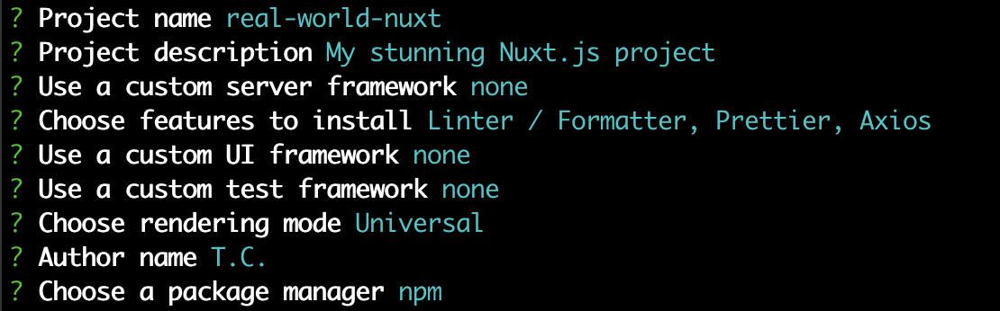
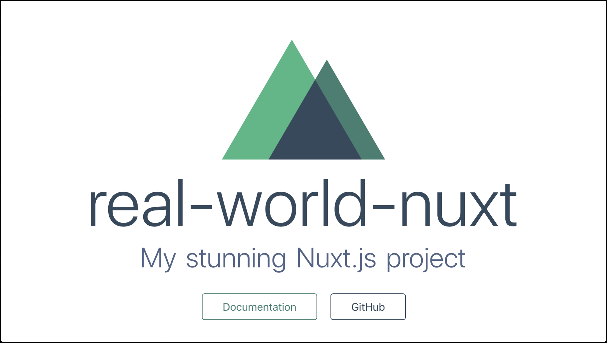
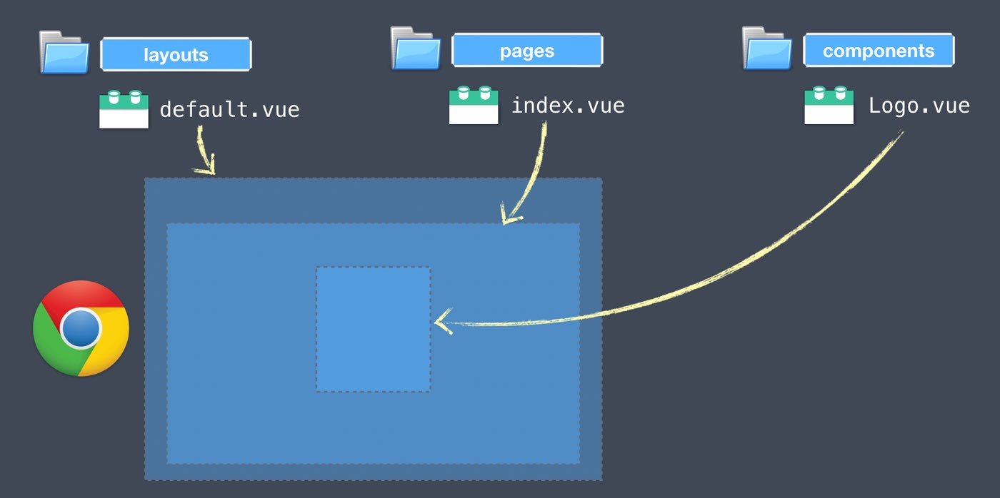
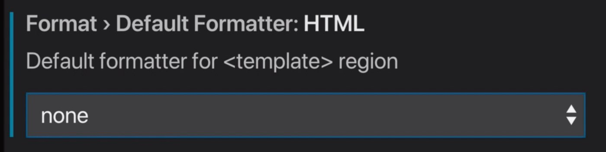
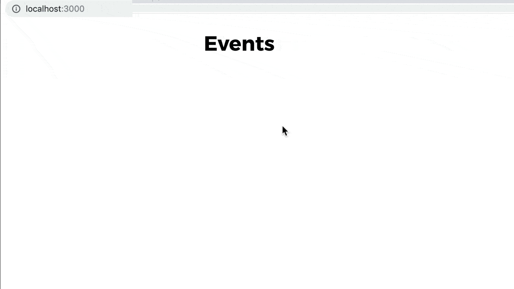
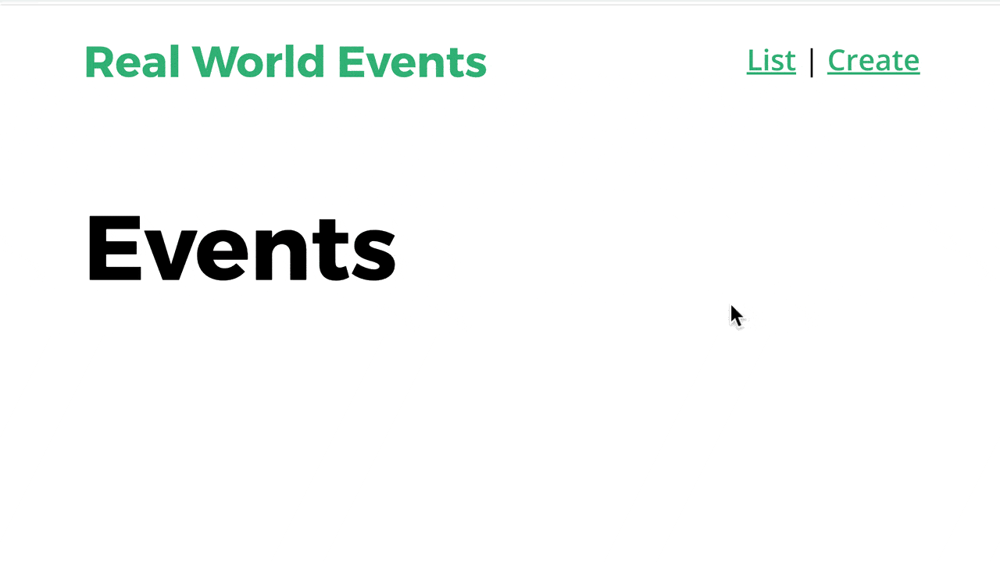

# 2. 創建一個 Nuxt app


現在我們知道為什麼要[使用 Nuxt.js](1.-why-use-nuxt.js.md) 來開發 Vue app，這個章節我們將一起打造一個 Nuxt.js app，帶你了解資料夾結構，並且開始打造我們的範例應用程式。在章節的最後我們的 app 將會有一個 lauout 版面和 2 個可以互相切換導覽的頁面。

## 先備知識

**HTML**、**CSS**、**基本 JavaScript**、
**Vue.js**、**Vue Router** 以及 **Vuex**。

## 建立最初的 Nuxt.js App

我們將會用到 `create-nuxt-app` 開始創建我們的應用程式。它是一個能幫助你創建 Nuxt.js 應用程式及搭建應用程式腳手架的命令列工具。它將協助你安裝 app 的預設資料夾結構，你可以依自己喜好選擇安裝
如 **Express** 或 **Koa** 的伺服器端框架並且也能安裝如 Nuxt Axios 模組以便於將 Axios 整合進你的 app。

準備開始前，請先確保你所使用的 npm 版本在 5.2.0 或更新版本。這樣才能夠確保 `npx` 指令有安裝上去，我們在後面將會使用到這個指令。

然後試著在你的終端機中輸入以下指令：

```
$ npx create-nuxt-app real-world-nuxt
```

**npx** 用來協助完成從 npm registry 使用 package 的工具 - 和 npm 用來簡化安裝及管理託管在 registry 上 package 間相依性的方法相同，npx 簡化使用 CLI 工具及其他託管在 registry 的可執行檔。以我們的情況來說，就是 `create-nuxt-app` package。

如果你使用 Yarn 管理 package，你可以執行 `yarn create nuxt-app real-world-nuxt`。他也會幫你做一樣的事。

在執行完 `npx` 或 `yarn` 指令後，創建 Nuxt App 會提示幾個用來設定你的 app 預設配置的問題。

以下就是我們專案將會使用到的配置。



然後它也會為你創建一個 git 倉庫，執行完之後再跑一下 `npm install` 以取回所以依賴的 package。

使用 `cd` 指令切換到這個剛建立好的專案，然後執行以下指令，就可以進入開發模式：

```
$ npm run dev
```

這個指令會將我們的 Nuxt.js 伺服器啟動為開發模式。預設網址為 `http://localhost:3000`/。在瀏覽器輸入網址後應該要看到以下的首頁。首頁附有連結到 [Nuxt 文件](https://nuxtjs.org/) 及 [Github](https://github.com/nuxt/nuxt.js) 的連結。



做完這些動作後，這會是做我們第一次 `git commit` 的好時機，然後再看看你要不要放到雲端倉庫如 github 或其他你常用的雲端原始碼管理服務。

做完這些我們就可以好好開始來打造我們的 events app 啦。在開始之前，我們先來過一下看看 `create-nuxt-app` 為我們建立的資料夾結構。

## Vue (非 Nuxt) 帶給我們什麼

 
 
 如果我們用 Vue CLI 創建一個 Vue 應用程式，CLI 將會為我們建立一個 `/src` 資料夾，並且裡面還有一個 `components` 資料夾。這樣我們在開發的時候會有些疑問：
 
 - 我們該將所有的組建全放在 `/components` 資料夾中嗎？
 - 我們是不是該建立一個 `/views` 資料夾？
 - 我們的版面該放在哪？你懂的，就是那些帶有 `<router-view/> 標籤的頁面？
 
 ## Nuxt.js 的組件資料夾結構
 
 在你的 code 編輯器打開剛剛建立的 Nuxt.js 專案，你會看見整個 Nuxt 應用程式的資料夾列表。首先你會注意到，裡面沒有 `/src` 資料夾，而且這些資料夾都在專案的根目錄。8 個資料夾中的其中 3 個是用來放組件的資料夾：
 
 - **layouts** ： 用來放版面的資料夾。例如：Blog 版面，商品頁版面，首頁版面等等...
 - **pages**：用來放高層級如用來做路由的頁面 (.vue 檔)
 - **components**：用來放可重用的 Vue 組件
 > Nuxt adds component functionality based on whifh directory your component is in.
 
 上面這幾個資料夾都會放 `.vue` 的組件檔，而且都是單一的檔案 [html 跟 script 沒有分開不同檔案之類的]，把這些檔案合在一起就可以看到如我們剛剛啟動開發 server 那樣的畫面。
 
 
 
以下是 Nuxt 為我們建立剩下的 5 個資料夾

### `/store`

這個資料夾包含所有你的 app 中 Vuex Store 會用到的檔案。Nuxt 提供了兩種不同建立 store 的方法，隨著課程進度我們將會更深入了解。

### `/static`

這個資料夾用來放靜態資源檔。例如：`robots.txt` 或 favicon。在這個資料夾裡的每個檔案會被對應到 server 的根目錄，通常在 `/`。

### `/assets`

這個資料夾用來放未編譯的資源檔，像是樣式表、 Sass 檔或是字型。
Nuxt 預設使用 vue-loader，file-loader 和 url-loader 的 webpack loader 做強型別資源檔的服務。如果你的資源檔不想被 webpack 影響到，就把他們放到 `/static` 資料夾。

### `/plugins`

這個資料夾包含了你想要在初始化根 Vue.js 應用程式之前的 JavaScript 插件。在使用自己的函式庫或 Vue 插件時，這個資料夾很有用。

### `/middleware` 

Middleware 讓你定義可以在頁面或頁面群組(版面)渲染前執行自訂的函式。而這個資料夾就是放這些為了這個目的所寫的 middleware。

最後，注意到有個叫 `nuxt.config.js` 的設定檔。之後會深入這個檔案的說明，現在只要了解這一個檔案可以用來寫入額外配置或修改 Nuxt 預設的配置。

**再來複習一下：**

## Nuxt 資料夾結構

- `layouts`：用來放版面。<sub>例如：部落格版面，購物車版面，首頁版面。</sub>
- `pages`：用來放高層級的頁面(.vue 檔)<sub>用於產生路由</sub>
- `components`：用來放可重用的 Vue 組件
- `store`：Vuex store 檔都放在這裡。
- `static`：服務路徑在 `/` 的靜態檔案。<sub>例如：robots.txt 或 favicon</sub>
- `assets`：未編譯的資源檔 <sub>例如：樣式，SASS，圖片或字型</sub>
- `plugins`：Vue app 啟動前載入的 JavaScript 插件。
- `middleware`：在渲染版面或頁面錢執行的自訂函式。
- `nuxt.config.js`：修改預設的 nuxt 配置。

## 圖片資源範例

我們通常會想把所有圖片放在 `assets` 資料夾，因為 Nuxt 會用 vue-loader、file-loader 以及 url-loader 幫你有效安排資源。比如說，假如我們放一個名稱為 `logo.png` 的圖檔到 `assets` 資料夾，那麼我們在組件樣板裡面想使用它的時候就可以寫成：

**/pages/index.vue**

```html

```

**在建置這個專案時，假如有大小 >= 1kb 的圖片時**，這張圖就會使用版本雜湊(*version hash*)，做檔案快取，且路徑也會自動轉成如以下：

```html

```

其中 `82f7965` 就是所謂的*雜湊*。這對我們來說是很有幫助的，因為如果 `logo.png` 的內容未來改變，但是檔名維持不變的話，雜湊值就會改變，這樣新的 logo 檔就會被重新載入到用戶的瀏覽器上。反之檔案沒改變的話，雜湊值不變，瀏覽器繼續載入快取中舊的圖檔，不用再從伺服器上載入圖檔，減少網路傳輸。

**在建置這個專案時，假如有大小 < 1kb 的圖片時**，這張圖會被嵌入到 `html` 中來降低 http 請求，看起來會像是下面的樣子：

```html

```

`...` 是省略了後面一長串的字串，這一長串的字串其實就代表圖片資料。藉由把圖片編碼直接放在標籤裡面，我們就可以避免額外用來取得檔案的網路傳輸。

## 創建我們的第一個頁面及路由

接下來我們將要開始建立前面兩個頁面及連結，好讓我們可以在兩頁面之間瀏覽。我們將會建立 `/pages/index.vue` ，這個頁面最終用來顯示活動列表，另外一個是 `/pages/create.vue`，我們用這個頁面來建立活動內容。當我們建立好這兩個頁面後，**你覺得我們會需要再建立 `route.js`** 檔案嗎？

**答案是不用滴～， Nuxt 會自動為我們建立好路由喔！我們不用再寫像下面那樣的程式碼囉。**

```javascript
    const router = new Router({
     routes: [
        {
          path: '/',
          component: 'pages/index.vue'
        },
        {
          path: '/create',
          component: 'pages/create.vue'
        }
      ]
    })
```

## 建立範例 App 的步驟

我們會照下列步驟來做：

1. 修正 VS Code. 的設定
2. 複製/貼上全域樣式到 `/layout/default.vue` 這個版面裡面
3. 簡化 `/pages/index.vue`
4. 啟動 dev server 並測試
5. 創建 `/pages/create.vue` 檔
6. 創建導覽組件 `/component/NavBar.vue`
7. 把上個步驟創建的 `NavBar`  組件加到 `/layout/default.vue` 中。

## 步驟一 - 修正 VS Code. 的設定

我們選擇 VS Code 為編輯器，並且使用 **Prettier** HTML 碼自動格式化插件及 **ESLint** 格式化插件，但這兩個插件彼此有些衝突的地方，因此我們要先來修正一下。

首先先到 **Preference => Settings => Extensions => Vetur**，然後把預設的 HTML 格式器從 **prettyhtml** 改成 **none**，如下：



## 步驟二 - 增加全域樣式到 `/layout/default.vue`

在開始建立範例 app 前，我們先把預設版面改一下。請注意我們加入 id 到 `<div>` 元素，以及一堆自訂樣式。你可能也會注意到，有個 `<nuxt />` 標籤，這是用來放 `/pages` 資料夾裡面產生的頁面。就像 `<router-view />` 那樣的效果。

**/layout/default.vue**

```javascript
    <template>
      <div id="app">
        <nuxt />
      </div>
    </template>
    
    <style>
    html {
      -webkit-text-size-adjust: 100%;
      -webkit-font-smoothing: antialiased;
      -moz-osx-font-smoothing: grayscale;
    }
    body {
      margin: 0;
      font-family: 'Open Sans', sans-serif;
      font-size: 16px;
      line-height: 1.5;
    }
    #app {
      box-sizing: border-box;
      width: 500px;
      padding: 0 20px 20px;
      margin: 0 auto;
    }
    hr {
      box-sizing: content-box;
      height: 0;
      overflow: visible;
    }
    a {
      color: #39b982;
      font-weight: 600;
      background-color: transparent;
    }
    img {
      border-style: none;
      width: 100%;
    }
    h1,
    h2,
    h3,
    h4,
    h5,
    h6 {
      display: flex;
      align-items: center;
      font-family: 'Montserrat', sans-serif;
    }
    h1 {
      font-size: 50px;
      font-weight: 700;
    }
    h2 {
      font-size: 38px;
      font-weight: 700;
    }
    h3 {
      font-size: 28px;
      font-weight: 700;
    }
    h4 {
      font-size: 21px;
      font-weight: 700;
    }
    h5 {
      font-size: 16px;
      font-weight: 700;
    }
    h6 {
      font-size: 15px;
      font-weight: 700;
    }
    b,
    strong {
      font-weight: bolder;
    }
    small {
      font-size: 80%;
    }
    .eyebrow {
      font-size: 20px;
    }
    .-text-primary {
      color: #39b982;
    }
    .-text-base {
      color: #000;
    }
    .-text-error {
      color: tomato;
    }
    .-text-gray {
      color: rgba(0, 0, 0, 0.5);
    }
    .-shadow {
      box-shadow: 0 1px 2px 0 rgba(0, 0, 0, 0.2), 0 1px 5px 0 rgba(0, 0, 0, 0.13);
    }
    .badge {
      display: inline-flex;
      height: 26px;
      width: auto;
      padding: 0 7px;
      margin: 0 5px;
      background: transparent;
      border-radius: 13px;
      font-size: 13px;
      font-weight: 400;
      line-height: 26px;
    }
    .badge.-fill-gradient {
      background: linear-gradient(to right, #16c0b0, #84cf6a);
      color: #fff;
    }
    button,
    label,
    input,
    optgroup,
    select,
    textarea {
      display: inline-flex;
      font-family: 'Open sans', sans-serif;
      font-size: 100%;
      line-height: 1.15;
      margin: 0;
    }
    button,
    input {
      overflow: visible;
    }
    button,
    select {
      text-transform: none;
    }
    button,
    [type='button'],
    [type='reset'],
    [type='submit'] {
      -webkit-appearance: none;
    }
    button::-moz-focus-inner,
    [type='button']::-moz-focus-inner,
    [type='reset']::-moz-focus-inner,
    [type='submit']::-moz-focus-inner {
      border-style: none;
      padding: 0;
    }
    button:-moz-focusring,
    [type='button']:-moz-focusring,
    [type='reset']:-moz-focusring,
    [type='submit']:-moz-focusring {
      outline: 2px solid #39b982;
    }
    label {
      color: rgba(0, 0, 0, 0.5);
      font-weight: 700;
    }
    input,
    textarea {
      box-sizing: border-box;
      border: solid 1px rgba(0, 0, 0, 0.4);
    }
    textarea {
      width: 100%;
      overflow: auto;
      font-size: 20px;
    }
    [type='checkbox'],
    [type='radio'] {
      box-sizing: border-box;
      padding: 0;
    }
    [type='number']::-webkit-inner-spin-button,
    [type='number']::-webkit-outer-spin-button {
      height: auto;
    }
    [type='search'] {
      -webkit-appearance: textfield;
      outline-offset: -2px;
    }
    [type='search']::-webkit-search-decoration {
      -webkit-appearance: none;
    }
    [type='text'],
    [type='number'],
    [type='search'],
    [type='password'] {
      height: 52px;
      width: 100%;
      padding: 0 10px;
      font-size: 20px;
    }
    [type='text']:focus,
    [type='number']:focus,
    [type='search']:focus,
    [type='password']:focus {
      border-color: #39b982;
    }
    ::-webkit-file-upload-button {
      -webkit-appearance: button;
      font: inherit;
    }
    [hidden] {
      display: none;
    }
    .error {
      border: 1px solid red;
    }
    select {
      width: 100%;
      height: 52px;
      padding: 0 24px 0 10px;
      vertical-align: middle;
      background: #fff
        url("data:image/svg+xml;charset=utf8,%3Csvg xmlns='http://www.w3.org/2000/svg' viewBox='0 0 4 5'%3E%3Cpath fill='%23343a40' d='M2 0L0 2h4zm0 5L0 3h4z'/%3E%3C/svg%3E")
        no-repeat right 12px center;
      background-size: 8px 10px;
      border: solid 1px rgba(0, 0, 0, 0.4);
      border-radius: 0;
      -webkit-appearance: none;
      -moz-appearance: none;
      appearance: none;
    }
    select:focus {
      border-color: #39b982;
      outline: 0;
    }
    select:focus::ms-value {
      color: #000;
      background: #fff;
    }
    select::ms-expand {
      opacity: 0;
    }
    .field {
      margin-bottom: 24px;
    }
    .error {
      border: 1px solid red;
    }
    .errorMessage {
      color: red;
    }
    </style>
```

## 步驟三 - 簡化 `/pages/index.vue`

接下來開啟 `/pages/index.vue` 檔，清空並換成以下內容：

**/pages/index.vue**

```html
    <template>
      <div>
        <h1>Events</h1>
      </div>
    </template>
```

## 步驟四 - 啟動 dev server 並測試

現在讓我們來試一下目前的程式碼，看看是不是都正確。在終端機輸入 `npm run dev` 啟動伺服器，然後打開瀏覽器網址輸入 http://localhost:3000 看看出現什麼。


讚啦👍！

## 步驟五 - 創建 `/pages/create.vue`

現在我們來創建第二個頁面，先用最簡單的樣版程式碼：

**/pages/create.vue**

```html
    <template>
      <div>
        <h1>Create An Event</h1>
      </div>
    </template>
```

試試看在瀏覽器位址列輸入，你會發現我們甚至不用創建或修改 `router.js` 檔，就可以在上面步驟建立的兩個頁面之間切換導覽。Nuxt 為我們做掉這些路由功能了。



## 步驟六 - 創建導覽組件 `/component/NavBar.vue`

接下來，先刪除 Nuxt 自動生成的 `/components/Logo.vue` 檔，然後新增一個檔案作為我們的導覽組件，請注意我們在檔案中使用 `nuxt-link` 而不是 `router-link` 來生成頁面連結。

**/copmponents/NavBar.vue**

```html
    <template>
      <div class="nav">
        <nuxt-link to="/" class="brand">Real World Events</nuxt-link>
        <nav>
          <nuxt-link to="/">List</nuxt-link>&nbsp;|
          <nuxt-link to="/create">Create</nuxt-link>
        </nav>
      </div>
    </template>
    
    <style scoped>
    .brand {
      font-family: 'Montserrat', sans-serif;
      font-weight: 700;
      font-size: 1.5em;
      color: #39b982;
      text-decoration: none;
    }
    .nav {
      display: flex;
      justify-content: space-between;
      align-items: center;
      height: 60px;
    }
    .nav .nav-item {
      box-sizing: border-box;
      margin: 0 5px;
      color: rgba(0, 0, 0, 0.5);
      text-decoration: none;
    }
    .nav .nav-item.router-link-exact-active {
      color: #39b982;
      border-bottom: solid 2px #39b982;
    }
    .nav a {
      display: inline-block;
    }
    </style>
```

好了，現在我們要把這個組件放到版面裡面。

**/layouts/default.vue**

```html
    <template>
      <div id="app">
        <nav-bar/>
        <nuxt/>
      </div>
    </template>
    <script>
    import NavBar from "~/components/NavBar.vue";
    export default {
      components: {
        NavBar
      }
    };
    </script>
    <style>
      ...
    </style>
```

好囉，現在我們都修改好了，到瀏覽器上看看我們的 Nuxt 應用程式。



## 來複習一下

這個章節我們學到了怎麼創建 Nuxt.js 專案，Nuxt 幫我們建立的各種不同資料夾，以及建立頁面組件然後將他們串連起來。下個章節我們將會學到 Nuxt.js 的 Universal 模式及 server-side rendering 如何幫助我們壯大 Vue app。

