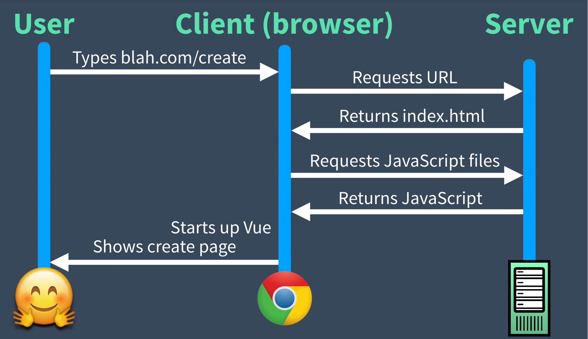
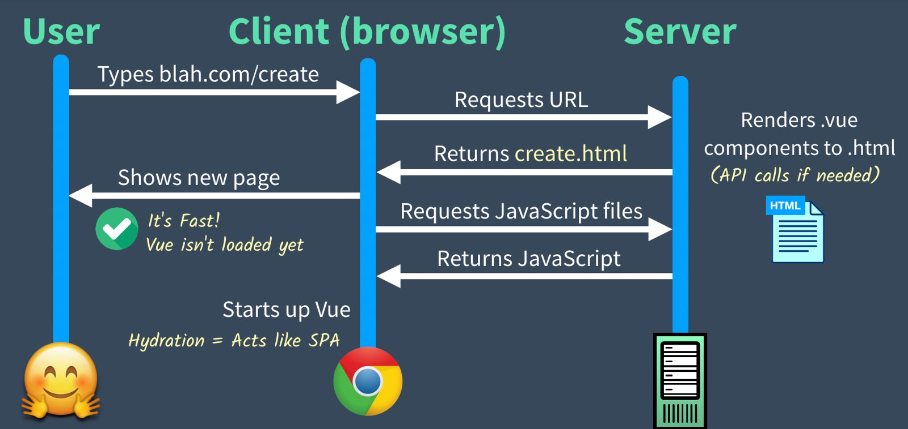
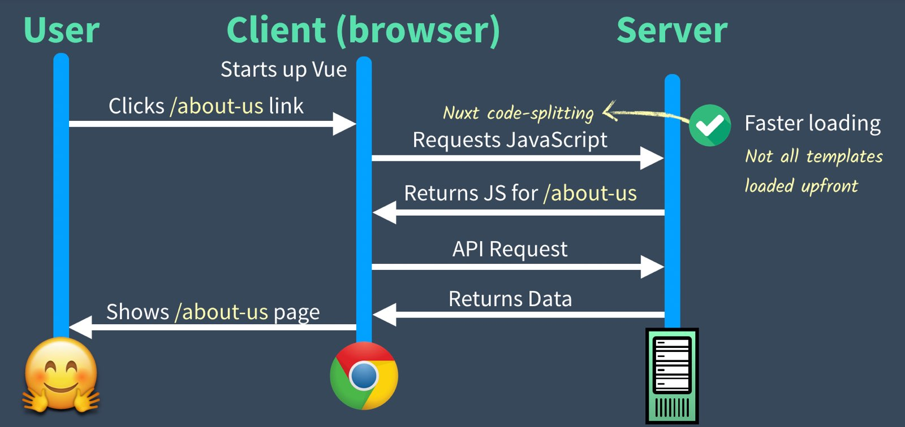
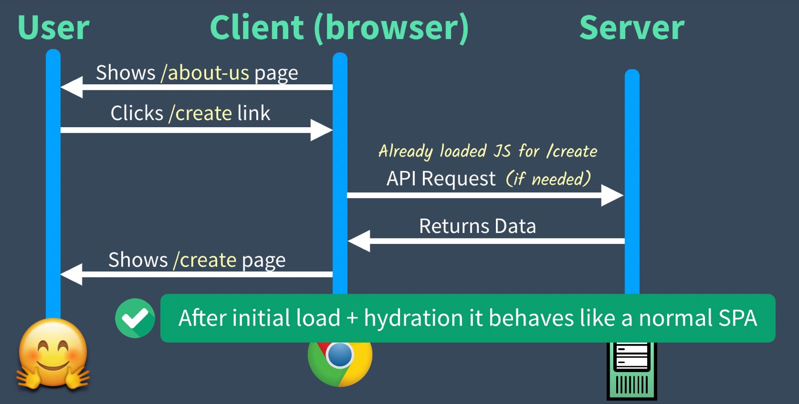
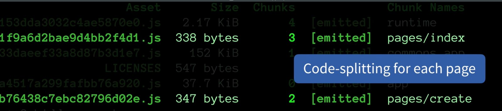

# 3. Universal Mode

在前面課程中，在生成範例專案的時候，我們要在 **Universal** 和 **SPA** 模式中選擇。當時選擇的是 **Universal** 模式，在這個章節我們會了解到選擇此模式會為我們的 Nuxt.js 應用程式帶來什麼好處。

## 🛑問題：SPA 初始載入慢慢的

如同之前 Real World Vue 課程中講解 Vue Router 時討論到的，在一般 web 應用程式中，當使用者請求如 `http://myapp.com/about-us` 的網址時，一般來說伺服器會回傳 `about-us.html`。 然而在一個單頁應用程式(SPA)中，任何的路由請求(甚至是 `/about-us`)都會回傳 `index.html`。這個 index 檔需要全部的 Vue JavaScript 檔，而且一旦 Vue 被初始化，Vue Router 才會載入並渲染 `about-us` 頁面，如下圖的 timeline：



這樣的情形可能會比你想要的更慢，特別是在低網速的時候。怎麼說呢？因為瀏覽器有很多事要處理：

- 下載 index.html
- 下載 Vue 應用程式的 JavaScript
- 初始化 Vue app
- 初始化 Vue Router 然後路由到合適的頁面組件
- 呼叫額外的 API 取得用來渲染頁面的資料
- 將樣板渲染為完整頁面內容

一旦都載入完成後，頁面應用程式其實是相當快的，然而就是那個初始化載入可能會很久。

## ☑️解法：Universal Mode

在我們一開始創建應用程式時，選擇了**Universal Mode**，它的意思是當我們的應用程式一開始載入時，它會在傳回初始 HTML 前在伺服器端先渲染好。看起來會像是下面這樣：



如你所看到的，新頁面在下載和執行任何 JavaScript 之前就顯示了。一旦下載完 JavaScript，Vue 跑起來然後頁面 "充水(Hydrated)"，基本上就代表應用程式轉變成一般的單頁面應用程式 SPA。
> 個人註解：會用到 Hydrated 這個詞我個人猜測是因為 Single Page Application 簡稱 SPA。
> SPA 這個詞大部分的人會聯想到美容或水療的那個 SPA，所以才用 Hydrate / Dehydrate 來形容目前應用程式的模式。成為 SPA 就是 Hydrated，反之則是 Dehydrated。

你可能會納悶 Vue 在瀏覽器啟動然後點了另一個連結(比如說 `/about-us`)之後，啊 Nuxt 那邊發生了什麼事？看起來會像是下面這張圖：



值得注意的地方是請求 JavaScript 這塊只會抓用來渲染 `/about-us` 這個頁面組件所需要的 JavaScript 而已。這是因為 Nuxt 預設會運用程式碼切割(code-splitting)功能，來把每一個頁面切割到不同的 JavaScript 檔，只有在需要的時候才會被載入。這樣子我們的應用程式就不會在一開始就載入一堆可能之後都用不到的組件程式碼。

不過如果使用者接著再點擊回到 `/create` 頁面，是不會再另外請求 JavaScript，因為它一開始已經載入了。



## 探索 Univerasl 模式

要來探索我們的範例 Universal app，可以用下面的指令讓它在 production 模式跑跑看：

```shell
$ npm run build
```

這個指令會創建編譯好同時給 server 和 client 端用的 JavaScript 檔，並且把每個頁面組件分割成不同的檔案。



然後再用下面的指令把應用程式啟動成 production 和 universal 模式：

```shell
$ npm start
```

現在如果打開瀏覽器，設定封鎖 JavaScript，可以發現這個初始頁已經完全渲染成 HTML 了。即使沒有 Vue，HTML 頁面還是很快速的渲染出來。


如果我們設定允許 JavaScript 然後重新整理頁面，會載入並顯示初始化的 html ，下載 JavaScript 檔，初始化 Vue，然後頁面 hydrated。

接著如果瀏覽到 `/create` 路徑，打開 DevTools 開發工具可以看到這頁的 JavaScript 被載入並執行。更進一步打開檔案內容來看的話會發現這個編譯過的樣板創建了一個虛擬節點(Virtual Node)。


 
## 智能預載 Smart Prefetching

在 Nuxt.js 2.4 版釋出了一個新功能，叫做 **智能預載 Smart Prefetching**，結合了 Universal mode 提供更佳的使用者體驗。藉由啟用這個功能(預設啟用)，當 `<nuxt-linK>` 的連結在畫面中顯示時，Nuxt.js 會自動預載該連結的預先切割程式碼。

注意看下面的影片，當畫面網上捲動到到導覽列的時候，`<nuxt-link>` 連結顯示出來，即使在點擊連接之前，那個頁面的 JavaScript 檔就被預載了。現在真的點擊連結以後，JavaScript 因為已經下載了所以可以立刻被執行而不用再等網路請求。


## 來複習一下

Universal mode 幫助增加初始頁面的載入速度，因為用了程式碼切割及智能預載(Smart Prefetching)加速頁面載入及顯示的速度。而這樣的加速改善了使用者體驗，這便是我們想要的結果。