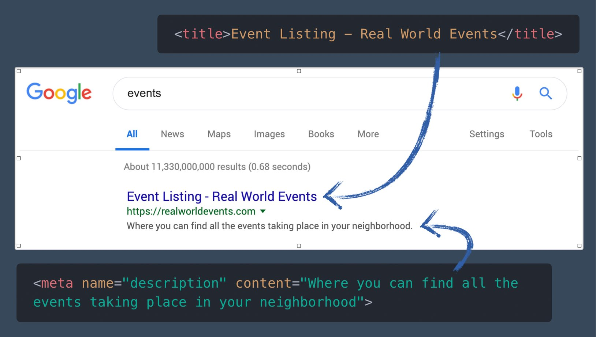
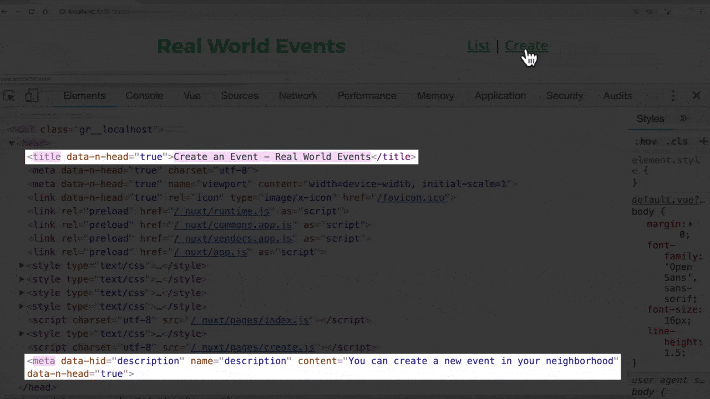
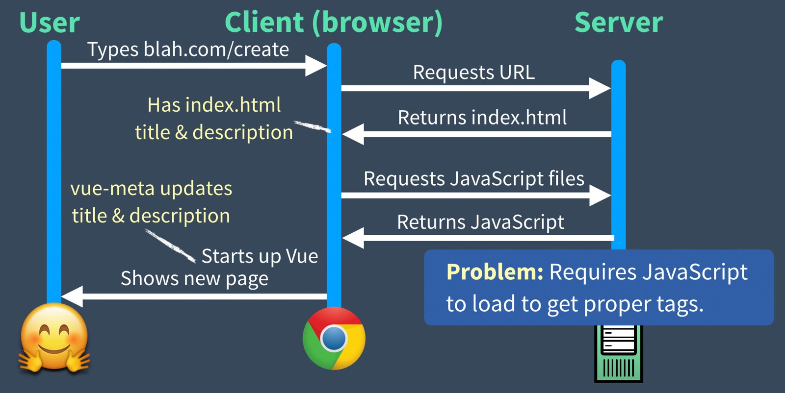
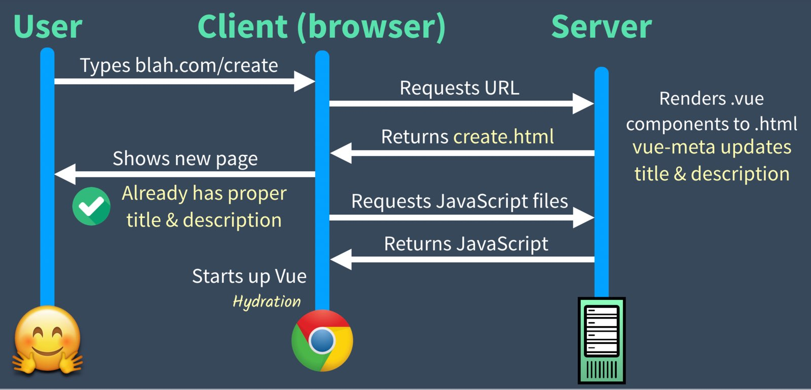

# 4. 使用 vue-meta 進行搜尋引擎優化(SEO)

另一個 Nuxt.js 的殺手級功能是他允許你為你的應用程式進行搜尋引擎最佳化(SEO)。在這一個章節我們會來看 Vue 單頁面應用會遇到的 SEO 問題，接著再來看建立在 Nuxt 裡面的函式庫 `vue-meta` 如何解決這個問題。

## 回頭看看我們的單頁面應用程式 SPA

記得上個章節這張用來解釋單頁面應用程式時間線的圖嗎？


如你所看到的，`/create` 頁面的內容直到 JavaScript 下載並執行，接著 Vue Router 載入頁面後才開始載入內容。頁面倚賴載入的 JavaScript 來渲染。
而這樣會有下面這些問題：

- 網路爬蟲可能不支援較新的 JavaScript 功能。
- Google 是唯一嘗試渲染 JavaScript 的搜尋引擎。
- 一個 JavaScript 錯誤可導致你整個網站沒辦法被加入索引。
- 假如頁面載入速度太慢也可能完全不被加入索引。
- 客戶端渲染的 JS 網站就歷史記錄來看排名不高。

因為以上原因，我們需要用更好的方法來做 SEO

## 為我們的範例 App 加些 SEO。

接著我們就來看看要怎麼在範例的 Nuxt 應用程式實作一些 SEO 功能，就從加入兩個標籤開始。
在應用程式中的每個頁面都要加入在搜尋引擎結果的標題標籤:

```html
  <title>Event Listing - Real World Events</title>
```

也會需要放在搜尋結果的簡介描述：

```html
<meta name="description" content="Where you can find all the events taking place in your neighborhood">
```

如果你不確定這些內容會怎麼顯示在搜尋頁面的話，下圖是我們的範例程式在 google 搜尋結果中看起來的樣子：



## vue-mtea

Nuxt.js 有個叫做 **vue-meta** 用來協助管理頁面 meta 資訊的函式庫，我們會用它來將標題和簡介標籤加到範例應用程式中。

首先，先到 `/pages/index.vue` 檔的 `<script>` 標籤裡面加入以下內容：

**📃 /pages/index.vue**

```javascript
    <script>
    export default {
      head() { // <-- vue-meta 用來加到 header 標籤的屬性
        return {
          title: 'Event Listing - Real World Events', // <-- 指定給我們的 title 標籤
          meta: [
            {
              hid: 'description',  
              name: 'description', // <-- 指定給我們的 description 標籤
              content:
                'Where you can find all the events taking place in your neighborhood'
            }
          ]
        }
      }
    }
    </script>
```

我們也可以用同樣的語法為 `create.vue` 加入他自己的標題和簡介：

**📃 /pages/create.vue**

```javascript
    <script>
    export default {
      head() {
        return {
          title: 'Create an Event - Real World Events',
          meta: [
            {
              hid: 'description',
              name: 'description',
              content: 'You can create a new event in your neighborhood'
            }
          ]
        }
      }
    }
    </script>
```

這是如果我們切換到瀏覽器，在開發工具(DevTools)裡查看一下 HTML，然後來回點一下兩個不同連結，可以發現標題和簡介也會跟著切換。



上面這些不是 Vue 預設的功能。我們還可以做兩件事來簡化程式碼：

1. **刪去重複：** "- Real World Events" 出現在每頁的 **title** 標籤，看起來是沒必要的重複。
2. **加入預設簡介：** 以防萬一開發人員忘了在某個頁面加入簡介，做個預設簡介比較保險，預設簡介內容
和 `index.vue` 裡面的內容相同。

上面這兩項修改都可以在 `/layout/default.vue` 做修改。

📃 **/layout/default.vue**

```javascript
    export default {
      head: {
        titleTemplate: '%s - Real World Events', // <-- 標題樣板
        meta: [
          {
            hid: 'description',
            name: 'description',  // <-- 從 index.vue 把這塊搬過來
            content:
              'Where you can find all the events taking place in your neighborhood'
          }
        ]
      },
```

注意到 title 樣板的 `%s` 嗎？這個是會放頁面標題的地方。而且我們也把簡介從 `/pages/index.vue` 搬過來了。這邊 `hid` 的值變的很重要。如果沒有給 `hid` 值就瀏覽到 `/create` 
這樣頁面裡面就會有兩個簡介，一個值從版面來，另一個從頁面來。

因此，藉由指定 `hid` 值可以確保我們的頁面只有一個唯一的簡介。
現在就來更新頁面～

📃 **/pages/index.vue**

```javascript
    <script>
    export default {
      head() {
        return {
          title: 'Event Listing'
        }
      }
    }
    </script>
```

這邊簡化了標題內容，然後因為會用版面裡面指定的簡介，所以也把簡介移除了。
接著 `create.vue` 也要更新一下。

📃 **/pages/create.vue**

```javascript
      head() {
        return {
          title: 'Create an Event', // <-- 簡化標題內容
          ...
```

假如你這時候再回去查看一下瀏覽器，結果會發現跟我們之前看到的一樣。

## 如果停用 JavaScript 會發生什麼事？

這邊就是 Nuxt Universal 模式神奇之處，在開始就啟用了很讚的 SEO。如果我這時候切換到瀏覽器，停用 JavaScript 然後將路徑切換到 `/` 或者是 `/create` ，它還是會載入適當的 SEO 標籤內容。在 SPA 單頁應用程式就不是這樣了。在 SPA 的場景，如果使用 vue-meta 可能會像下圖：



如你所看到的，當我們瀏覽到 `/create` 頁面時，停用 JavaScript 會導致從 `index.vue` 載入標題和簡介而不是從 `create.vue`。但因為我們用了 nuxt.js 的 Universal 模式，過程會像下面這張圖：



如你所見，Universal 模式表示所有請求都會回傳帶有正確標題和簡介的 HTML。

vue-meta 允許你加入各種 SEO 標籤到頁面，[文件在這邊](https://vue-meta.nuxtjs.org/api/#metainfo-properties)。

## ⏪ 複習

在這個章節我們學到了 Nuxt 怎麼運用 `vue-meta` 來讓你很容易的為你的頁面指定 SEO header 標籤。
我們也學到 Universal 模式時如何確保我們的頁面能夠恰當的被搜尋引擎加入索引，因為它們不需要用到 JavaScript 來讓標籤被讀取到。


