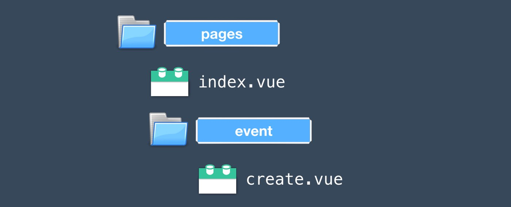
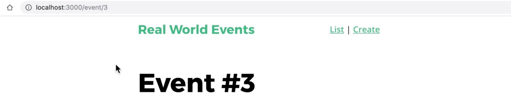
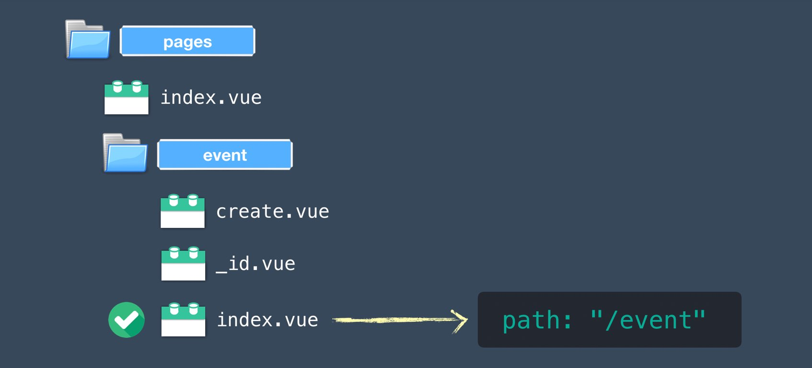
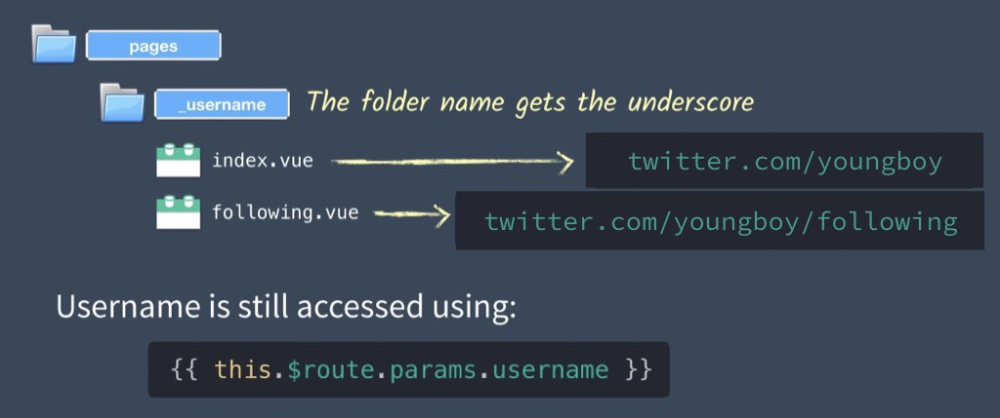
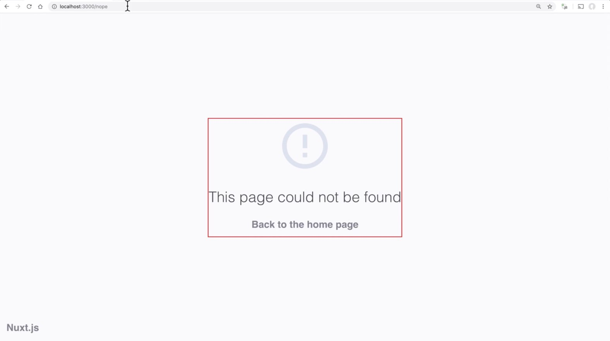
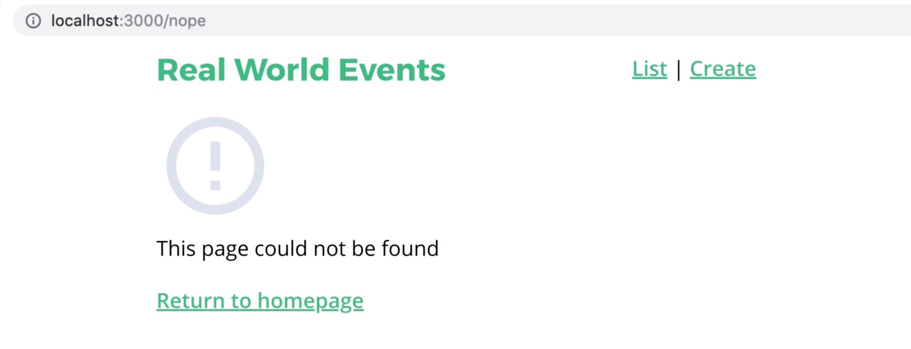
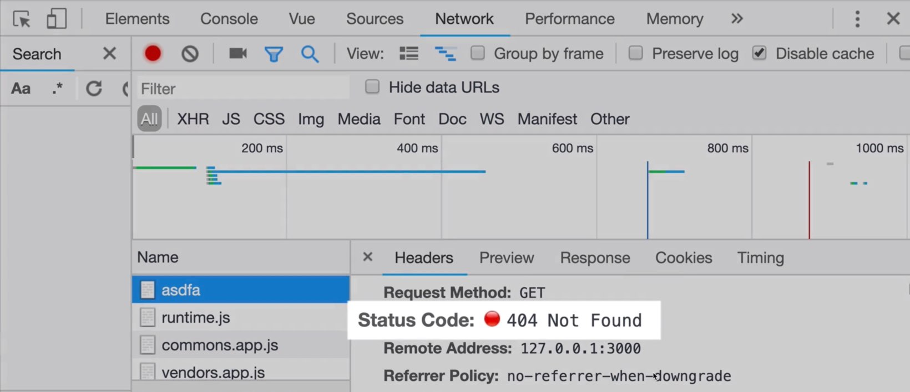

# 5. 靠檔案位置來路由

正如前面章節所學到的，有了 Nuxt 我們只要把組件在 `pages` 資料夾放好來，Nuxt 就會為我們代勞產出 `router.js`。你可能會覺得 Nuxt 預設是 **靠檔案來做路由**。

在這個章節我們會更深入這個主題，學習怎麼找到 Nuxt 為我們創建的 `router.js` (對除錯蠻有幫助的)，巢狀路由，動態路由以及怎麼樣來覆寫 Nuxt 預設的錯誤頁面。

## Nuxt 產出的 router.js

目前在範例應用程式的 `pages` 資料夾中有2個檔案，`create.vue` 和 `index.vue`。
如果想查看 Nuxt 為我們創建的 `router.js` 檔，要先確認伺服器還在執行然後到伺服器產出的 `.nuxt` 資料夾看看。

📜 **/.nuxt/router.js**

```javascript
    ...
        routes: [{
          path: "/create",
          component: _2a60c538,
          name: "create"
        }, {
          path: "/",
          component: _c3751f8a,
          name: "index"
        }],
    ... 
```

從上面檔案的內容可以了解到，Nuxt.js 基於 `pages` 資料夾的檔案結構為我們產出了 `router.js` 檔。
隨著在 `pages` 資料夾裡面增加更多檔案和資料夾，參考 `router.js` 檔對我們在除錯的時候很有幫助，可以協助我們確保路由有被正確設定。

## 巢狀路由

如果想做巢狀路由，我們只要簡單的把檔案放到資料夾裡面去即可。（如下圖）



如果現在我去檢查一下 `router.js`，會看到跟著調整的路由內容。

📜 **/.nuxt/router.js**

```javascript
    ...
        routes: [{
          path: "/event/create",
          component: _2a60c538,
          name: "event-create"
        },
    ... 
```

只要把檔案放到資料夾裡面就可以，巢狀路由就是這麼簡單～

## 🛑 問題：檢視指定的活動 Event

我們這個範例應用程式其中最重要的路由之一就是要路由到單一的 Event。URL 大概像是這樣：`/event/12345`,其中 `12345` 代表 Event 的 id。當使用者瀏覽到這樣的 URL 時，他們可以看到這個 Event 的所有詳細資料。

傳統上，在 Vue 我們要在 Vue Router 創建動態路由時，會用 `:` 字元來表示它是個動態路由。
這個也被稱為動態片段(dynamic segment)。看起來會像是下面這樣：

```javascript
  path: '/event/:id',
```

然而在 Nuxt 的世界我們不需要自己寫 `router.js`，那...該怎麼做呢？

✅ 解法：Nuxt 動態路由

另一方面，在 Nuxt 的世界裡，在 `pages` 資料夾裡面以底線 (`_`) 開頭的組件檔，底線後面的檔名會被用來當作創建動態路由的參數。

我們來試試看用 `id` 當作參數來路由到指定 Event 的話，這樣檔名就會被命名為 `_id.vue`。

📜 **/pages/event/\_id.vue**

```vuejs
    <template>
      <div>
        <h1>Individual Event: {{ this.$route.params.id }}</h1>
      </div>
    </template>
```

就跟 Vue 一樣，Nuxt 給你用 `$route` 物件連接內部 Vue 組件。 使用 `params` 物件然後搭配連接檔名。以上面的情形為例就會變成 `this.$route.params.id`。

接著如果我們訪問
`http://localhost:3000/event/3` 將會看到：



## 那要怎麼做到 SEO 呢？

我們的 Event 詳細資訊頁面也需要有動態的標題和簡介以做到 SEO。
我們來把 `id` 放到 title 和 description 標籤。

```vuejs
    <template>
      <div>
        <h1>Event #{{ id }}</h1>
      </div>
    </template>
    <script>
    export default {
      head() {
        return {
          title: 'Event #' + this.id,
          meta: [
            {
              hid: 'description',
              name: 'description',
              content: 'What you need to know about Event #' + this.id
            }
          ]
        }
      },
      computed: {
        id() {
          return this.$route.params.id
        }
      }
    }
    </script>
```

注意到了嗎？`this.$route.params.id` 被我做成 computed 屬性了，這樣我就不用一直打這一長串來取得 `id` 的值。呼～ Vue 謝啦。

⏩ 附註：如果我們想要有 `http://localhost:3000/event` 這一頁要怎麼辦咧？

在這個情況下，我們要創建一個新的 `/event/index.vue` 組件。



## 根路徑的動態路由

現在暫時先放下範例程式，想想兩個例子。
第一，要怎麼創建像 twitter 那種動態的根路徑路由 `twitter.com/youngboy`？

要在 Nuxt 做到這個功能，只要創建一個 `/pages/_username.vue` 的組件，然後就可以藉由存取 `{{ this.$route.params.username }}` 抓到 username 參數值。

沒錯，任何在底線後面的名稱都會被當作是 parameter 參數，可能是 id，username 或任何你想要用的名稱。

舉例來說，在 twitter 上想找到 youngboy 追蹤的人，我可以下這樣的網址：
`twitter.com/youngboy/following`

像這樣的情形，資料夾就要以底線開頭來命名：



## 自訂錯誤頁面

在預設的情形下，在我們的範例應用程式瀏覽到錯誤的 URL 時，會得到下面的預設錯誤頁面：



因為我們在頁面中放上自訂的樣式，所以可以看到錯誤訊息環繞著紅色的外框，以及在左下角的 "Nuxt.js"。
很顯然的，我們應該要修正這兩個地方。而且如果把預設版面中上方的導覽列加進來也會比較好一點。

## 創建我們自己的錯誤頁面

為了創建我們自己的錯誤頁面，我們先來從[Nuxt.js 預設錯誤頁面](https://github.com/nuxt/nuxt.js/blob/dev/packages/vue-app/template/components/nuxt-error.vue)裡面 copy 些程式碼，以及創建以下放在 `layouts` 資料夾裡面的檔案。請注意，即使這些檔案是放在 `layouts` 資料夾，它們還是會被當作頁面組件來處理，也會使用預設的版面。

📃 **/layouts/error.vue**

```vuejs
    <template>
      <div>
        <svg xmlns="http://www.w3.org/2000/svg" width="90" height="90" fill="#DBE1EC" viewBox="0 0 48 48">
          <path d="M22 30h4v4h-4zm0-16h4v12h-4zm1.99-10C12.94 4 4 12.95 4 24s8.94 20 19.99 20S44 35.05 44 24 35.04 4 23.99 4zM24 40c-8.84 0-16-7.16-16-16S15.16 8 24 8s16 7.16 16 16-7.16 16-16 16z" />
        </svg>
        <div class="title">
          {{ message }} 
        </div>
        <p v-if="statusCode === 404">
          <nuxt-link to="/">
            Return to homepage
          </nuxt-link>
        </p>
      </div>
    </template>
    <script>
    export default {
      name: 'NuxtError',
      props: {
        error: {  // <--- Send in the error
          type: Object,
          default: null
        }
      },
      head() {
        return {
          title: this.message // <--- Set the SEO title
        }
      },
      computed: {
        statusCode() {  // <--- Get the status code
          return (this.error && this.error.statusCode) || 500
        },
        message() {  // <--- Print the error
          return this.error.message
        }
      }
    }
    </script>
```

現在如過我們再瀏覽到錯誤頁面的話就會看到：



是不是看起來變得比較棒？而且還有預設版面呦～

## 福利：Nuxt 會給你適當的狀態碼

讓我們到開發工具裡面看看，如果請求了錯誤的頁面，我們可以看到 Nuxt 的確適當的回傳了 **404 Not Found**的狀態碼。



敲棒der！因為 Vue.js 壓根兒不回做這件事。記住了，在 Vue 的 SPA 模式，不管使用者輸入什麼 URL，它都只會回傳 `index.html`。因此而無法被設置來給予適當的狀態碼。

**為什麼不使用適當的狀態碼很糟糕？**

因為最終我們的網站會有些頁面（或活動）會結束或被刪除。但如果搜尋引擎已經把這些頁面加入索引的話，那他們可能還會留著舊連結，這些舊連結可能會帶出錯誤或網頁不存在的文字。

回傳 `404 Not Found` 的狀態碼會是通知搜尋引擎這個頁面已經不再存在的最佳方式，因為搜尋引擎會停止連結到這些頁面。

Nuxt 之所以能夠回傳 `404 Not Found` 狀態碼是因為它用了 Universal 模式渲染頁面。它會在伺服器端就知道某個頁面不存在，所以就可以回傳合適的狀態碼。這也是另一個你的 production 應用程式或許應該使用 SSR（Server Side Rendering）的原因。

## ⏪ 複習

在本章節中，我們更深入探討 Nuxt 的路由。學會了如何創建巢狀路由，動態路由（使用底線`_`），以及創建我們自己的錯誤頁面。
在下個章節我們將會學到要怎麼呼叫 API 去取得真實資料。


