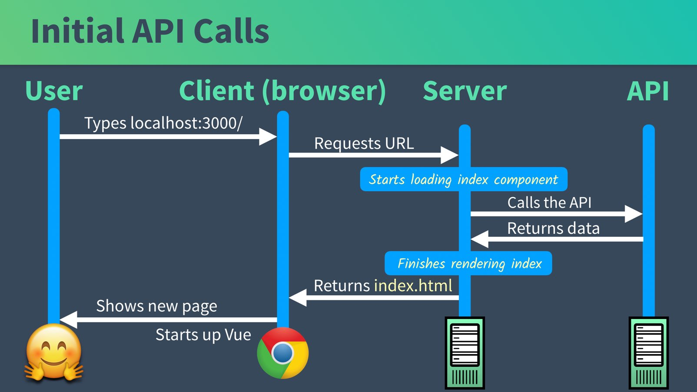
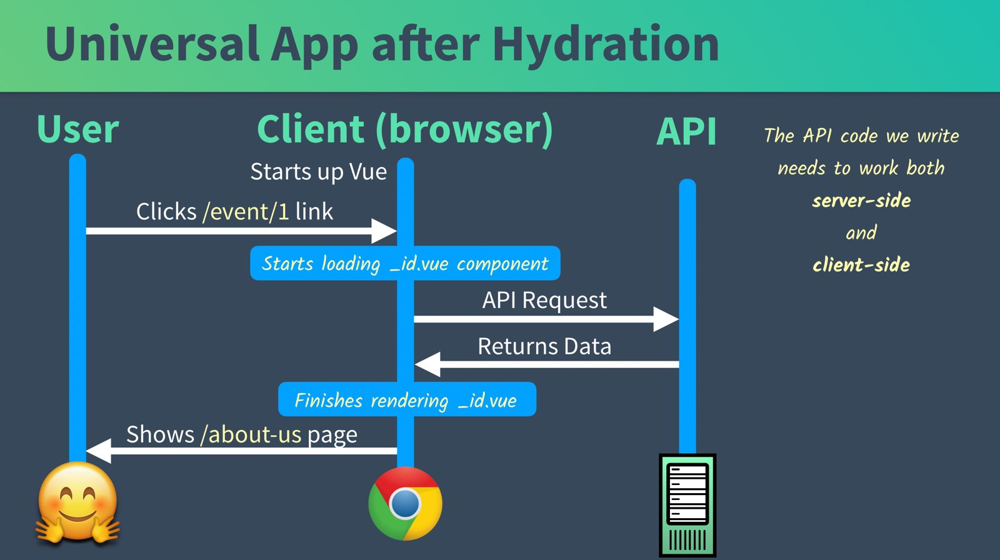
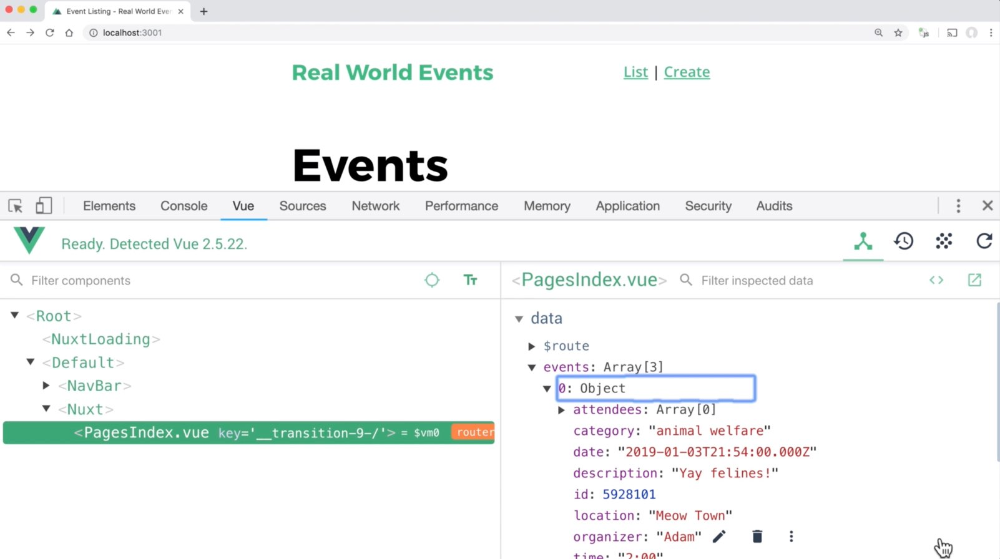
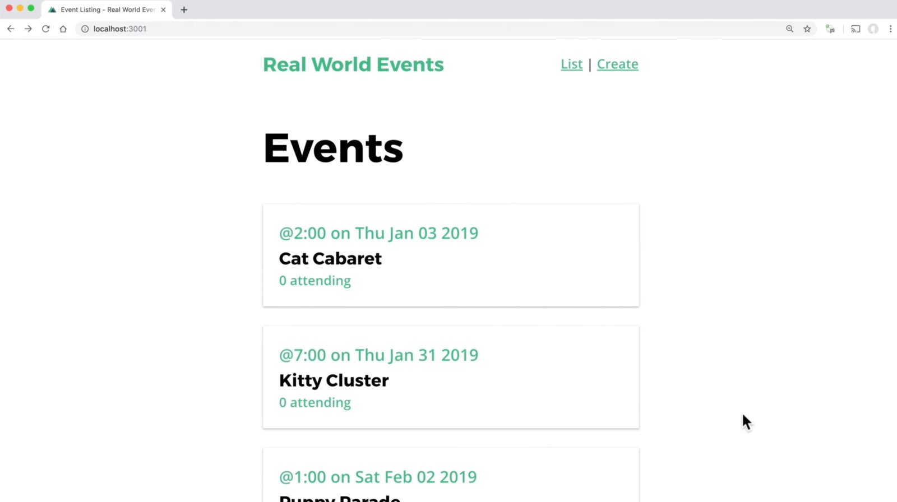
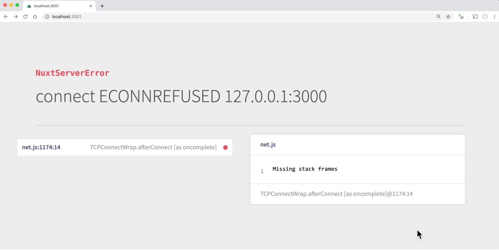
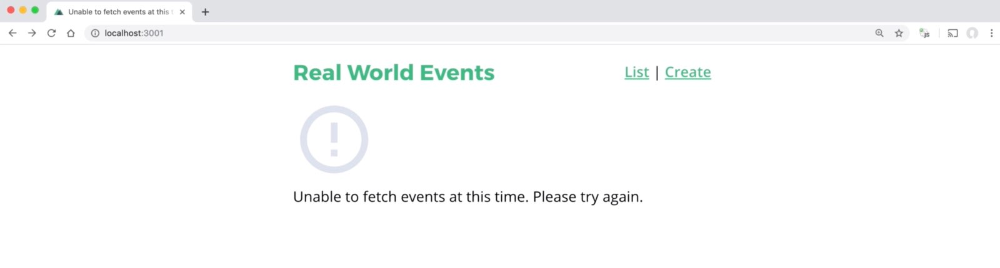

<link rel="stylesheet" href="assets/style.css" type="text/css" />
# 6. 呼叫 API：使用 Axios

因為我們創建的是 Universal 應用程式，所以在呼叫 API 的時候會稍微不一樣。在這個章節我們可以學到要怎麼設置好一個用來跑 API 呼叫的 dummy 資料庫，學到如何用 `Axios` 及 `Promise` 寫我們的一個 API 呼叫，最後還有要來設置好適當的錯誤處理。

## API 是在哪裡被呼叫的捏？

現在讓我們來看看，當載入一個組件資料的時候，API 是怎麼被呼叫的。
下面是在初始化載入的時候所發生的事情。



然後一旦 Vue 起來了，API 呼叫會從 client 端這邊開始。



所以我們需要將 API 呼叫寫在我們組件中的方法，而這個方法在 server 端和 client 端都可以運作，感覺要同時滿足這兩個條件會很棘手。好在 Nuxt 又再次解救了我們（Universal 模式）。

## 設置：一個給 App 用的模擬 API

為了要開始抓資料並顯示活動 Event，首先我們需要一個給我們 app 用的 API。

我們會需要 `json-server`，有了他我們就可以很快的創建一個模擬 API 而不用設定什麼麻煩的伺服器。

在開始安裝之前，我們要先來把會回傳的 JSON 資料寫到一個檔案裡面。然後把檔案放到應用程式的根目錄下面。

**JSON 資料如下**
```javascript
{
  "events": [
    {
      "id": 5928101,
      "user": {
        "id": "abc123",
        "name": "Adam"
      },
      "category": "animal welfare",
      "organizer": "Adam",
      "title": "Cat Cabaret",
      "description": "Yay felines!",
      "location": "Meow Town",
      "date": "2019-01-03T21:54:00.000Z",
      "time": "2:00",
      "attendees": []
    },  
    {
      "id": 8419988,
      "user": {
        "id": "abc123",
        "name": "Adam"
      },
      "category": "animal welfare",
      "organizer": "Adam",
      "title": "Kitty Cluster",
      "description": "Yay cats!",
      "location": "Catlandia",
      "date": "2019-01-31T22:09:00.000Z",
      "time": "7:00",
      "attendees": []
    },
    {
      "id": 4582797,
      "user": {
        "id": "abc123",
        "name": "Adam"
      },
      "category": "animal welfare",
      "organizer": "Adam",
      "title": "Puppy Parade",
      "description": "Yay pups!",
      "location": "Puptown ",
      "date": "2019-02-02T23:27:00.000Z",
      "time": "1:00",
      "attendees": []
    }
  ]
}
```

接下來就是把 JSON server 抓下來安裝跑起來。下面是安裝指令：

```
npm install -g json-server
```

再來就是把這個剛安裝好的 server 給叫起來：

```
json-server --watch db.json
```

當 server 成功跑起來之後你會看到：

```shell
    \{^_^}/ hi!
        
    Loading db.json
    Done
        
    Resources
    http://localhost:3000/events
        
    Home
    http://localhost:3000
        
    Type s + enter at any time to create a snapshot of the database
    Watching...
```

如果現在到瀏覽器上瀏覽網址 `http://localhost:3000/events` 的話，我們可以看到所有的活動 event 以 json 格式呈現在瀏覽器上面。

預設來說，我們的 Nuxt app 在開發狀態會啟動在 port 3000， 但是現在我們開的 `json-server` 也是 port 3000，為了不讓兩個 server 撞 port，我們得把 Nuxt app 開在另外一個 port ，方法是在啟動 dev server 的時候加一個參數：

```shell
PORT=3001 npm run dev
```

這樣 Nuxt 應用程式就會開在 port 3001 上面，`json-server` API 可以繼續在 port 3000 上面跑。

## 設置：安裝用來呼叫 API 的 Axios

Axio 是 Nuxt 上理想的 HTTP 函式庫。Nuxt 的主要目的是用來簡單的創建 Universal 模式的 JavaScript app，而 Axios 則是把製作 server 及 browser 端的 HTTP 請求變得簡單。

再最前面的章節中，我們使用 `create-nuxt-app` 創建 app 的時候，就已經在 Nuxt 安裝了 Axios 模組。

如果沒有在一開始就安裝也沒關係，下這個指令就可以把它安裝到你的專案中：

```shell
npm install @nuxtjs/axios
```

執行完之後，打開 `nuxt.config.js` 檔然後加入這幾行：

*nuxt.config.js*

```javascript
  module.exports = {
    modules: [
      '@nuxtjs/axios',
    ]
  }
```

請注意我們不是安裝 Axios，而是 Nuxt Axios 模組。這個模組有一堆額外的功能，比如說像是：

- 在做 HTTP 請求的時候整合了 Nuxt.js 進度條
- 整合了 Proxy 模組
- 自動以 axios-retry 重新發出 HTTP 請求

還有更大堆的功能，你可以參考官方的 [Github 頁面](https://github.com/nuxt-community/axios-module)

## 🛑 問題：該怎麼去抓我們的活動列表 EventList？

我們想要在 `/pages/index.vue` 裡呼叫 API 抓出所有活動 event 列表到前端頁面。首先如果 HTTP 請求的是活動 event 列表，就在 server 端抓，如果要導覽到活動 event 詳細資料頁面就在 client 端抓活動 event 資料。

那麼我們要怎麼呼叫 API 來抓活動 event 資料呢？和 Vue.js 完全不同的是，我們不會用到 `created()` 這個生命週期鉤子(hook)。Nuxt 為我們的 `pages` 資料夾中的組件額外的鉤子(hook)，其中包括：

## 解決方案：Nuxt 的 asyncData

`asyncData` 會在每次載入 **page** 組件之前被呼叫，所謂 **page** 組件指的是放在 `pages` 資料夾裡面的組件。在第一次 Nuxt app 請求的時候進行 server 端呼叫，導覽到更進一步路由的時候進行 client 端呼叫。這個方法接收 [context](https://nuxtjs.org/api/context) 為第一個參數，可以被用來抓取某些資料（從 API），然後 Nuxt 會將回傳值搭配組件資料合併起來。

這個 `context` 參數讓你存取各種屬性，比如說 `app`，`$axios`，`params`，`route`，`error`等等。在前一個章節我們用 `context` 物件抓路由參數。在這個章節我們則是用它來使用 **axios**。


## 擷取資料給我們的活動 event 列表

在前一個章節中我們在 `pages` 根目錄下面的 `index.vue` 頁面中創建了一個活動 event 頁面。我們來試試看用裡面的 `asyncData` 來抓資料。

```javascript
  <script>
    export default {
      ...
      asyncData(context) {
        return context.$axios.get('http://localhost:3000/events').then(response => {
          return {
            events: response.data
          }
        })
      }
    }
  </script>
```

如你所見，我們從 `context` 裡用 `$axios` 物件然後進行 `get` 請求。這個請求會回傳一個 `promise`，然後我們再使用 `then` 在 `promise` 回傳時指定要跑什麼程式碼。而在這個例子我們會回傳包含 `events` 的物件，它會合併到我們的組件資料。我們可以使用 ES6 的解構語法來簡化程式碼如下：

```javascript
    <script>
    export default {
      ...
      asyncData({ $axios }) {
        return $axios.get('http://localhost:3000/events').then(response => {
          return {
            events: response.data
          }
        })
      }
    }
    </script>
```

請注意我們怎麼結構 `context` 物件，只去處裡面我們想要的 `$axios` 模組。`{ $axios }`，就是把想要的物件/模組放在 `{}`裡面，超過一個的話就用 `,` 隔開。

這個時候回去看看瀏覽器，然後用 Vue Dev Tools 檢查一下就可以看到資料都載入了。



## 渲染活動 Event 列表

在前面的章節我們把有關活動 event 列表的程式碼都放到 `page`組件裡面去渲染畫面。但 Vue 的美好之處就在於你可以把程式碼整理到各種組件裡面去。因此我們現在來創建一個**EventCard**組件來顯示我們的每個活動 event：

📃 **/components/EventCard.vue**

```javascript
    <template>
      <nuxt-link :to="'/event/' + event.id">
        <div class="-shadow">
          <span class="eyebrow">
            @{{ event.time }} on {{ parsedDate }}
          </span>
          <h4 class="title">
            {{ event.title }}
          </h4>
          <span>{{ event.attendees.length }} attending</span>
        </div>
      </nuxt-link>
    </template>
    <script>
    export default {
      name: 'EventCard',
      props: {
        event: Object
      },
      computed: {
        parsedDate() {
          const eventDate = new Date(this.event.date)
          return eventDate.toDateString()
        }
      }
    }
    </script>
    <style scoped>
    div {
      padding: 20px;
      margin-bottom: 24px;
      transition: all 0.2s linear;
      cursor: pointer;
    }
    div:hover {
      transform: scale(1.01);
      box-shadow: 0 3px 12px 0 rgba(0, 0, 0, 0.2), 0 1px 15px 0 rgba(0, 0, 0, 0.19);
    }
    .title {
      margin: 0;
      color: black;
    }
    a {
      text-decoration: none;
    }
    </style>
```

然後我們來把原來 `pages/index.vue` 裡面的程式碼改成用 **EventCard** 組件來顯示活動 event 列表。

📃 **/pages/index.vue**

```javascript
    <template>
      <div>
        <h1>Events</h1>
        <EventCard
          v-for="(event, index) in events"
          :key="index"
          :event="event"
          :data-index="index"
        />
      </div>
    </template>
    <script>
    import EventCard from '@/components/EventCard.vue'
    export default {
      head() {
        return {
          title: 'Event Listing'
        }
      },
      asyncData({ $axios }) {
        return $axios.get('http://localhost:3000/events').then(response => {
          return {
            events: response.data
          }
        })
      },
      components: {
        EventCard
      }
    }
    </script>
```

改好後到瀏覽器看看結果，活動 event 列表出來啦～



## 錯誤處理

如果我們把 API server 關掉然後再回到瀏覽器，會看到以下的錯誤訊息：



這樣還不夠理想，我們應該可以再捕捉(catch)這個錯誤然後顯示更好更恰當的訊息。

```javascript
      asyncData({ $axios, error }) {
        return $axios.get('http://localhost:3000/events').then(response => {
          return {
            events: response.data
          }
        }).catch(e => {
          error({ statusCode: 503, message: 'Unable to fetch events at this time, please try again' })
        })
      },
```

注意喔，我們把 `error` 物件包含進來，這樣就可以在 `catch` 區塊使用上個章節創建的錯誤頁面。在瀏覽器上看起來會像是這樣：



是不是好多惹！

## 複習

在這個章節中我們學會了設置模擬的 API server，並且學到要怎麼用 Nuxt Axios 模組中加到 page 組件的 `asyncData` 鉤子（hook）。然後也加上適當的錯誤處理讓處理錯誤頁面組件可以使用。


