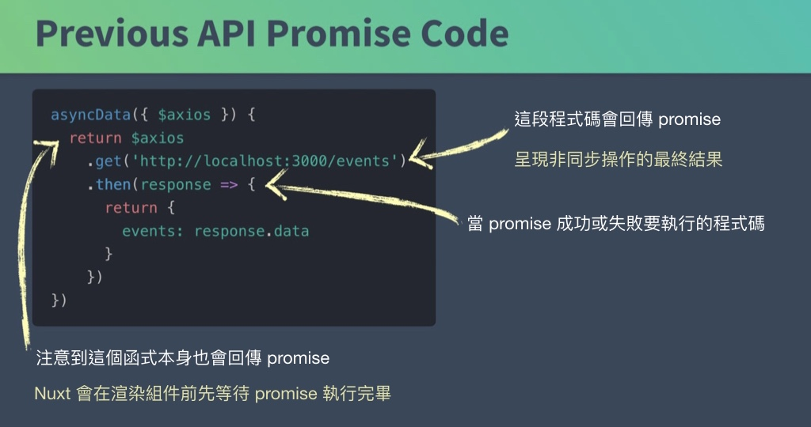
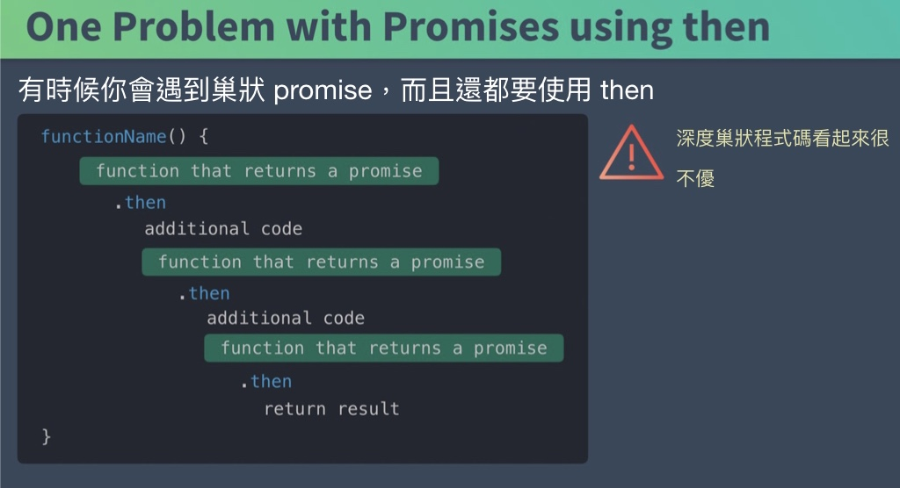
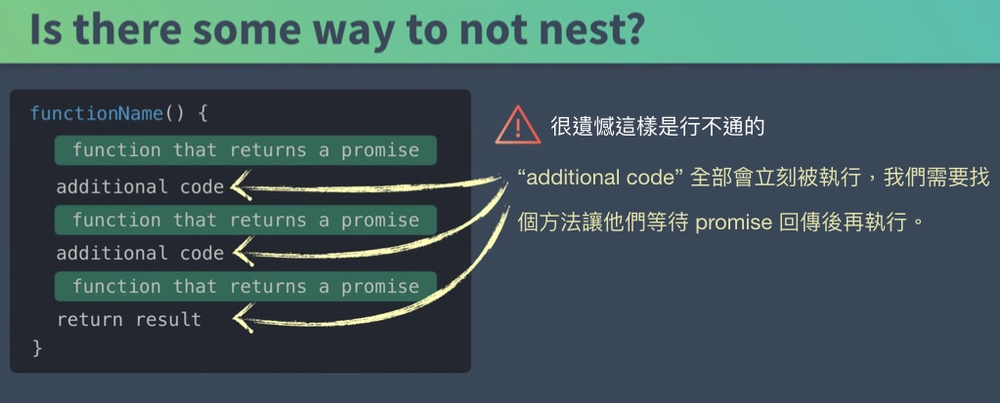
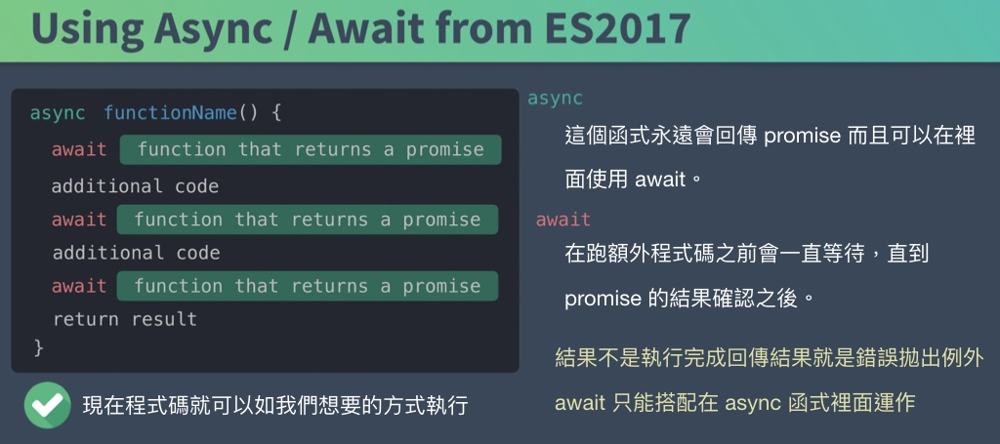
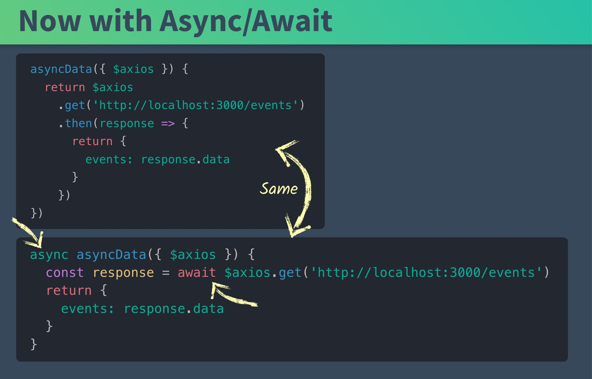
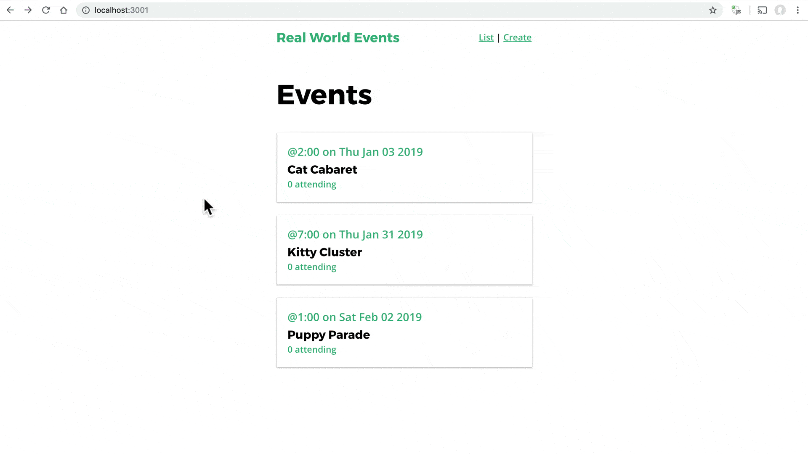
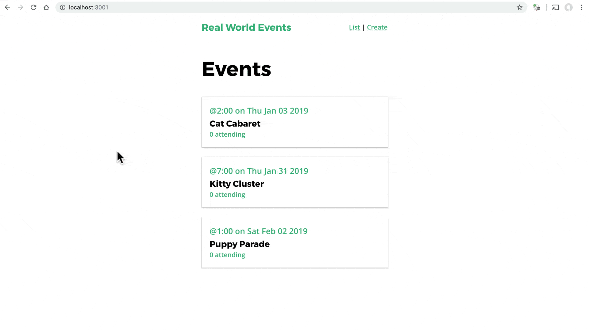

# 7. Async/Await & 進度條

在本章節中我們會繼續打造 API 呼叫，首先使用的是 Nuxt 應用程式常見的 Async/Await。接著再打造 event 活動顯示頁面，在我們瀏覽指定活動如 `/event/1` 時加入額外的 API 呼叫。最後再加入進度條的功能。

## Async/Await

在前一個章節，我們的 API 程式碼看起來像下面這樣：



然而，使用 `promise` 搭配 `then` 時，程式碼在進行一堆巢狀呼叫的時候會開始陷入像下圖那樣的混亂：



就如你所見，在程式碼中用一堆巢狀的 `then` 可能不是太優。在完美世界中我們應該有些可以讓程式碼不變得巢狀的方法，或許看起來像下面這樣：



不過這樣的程式碼是沒法跑的。這也是為什麼需要用到 `async/await` 的原因，利用這兩種語法來跑這類的程式。



那這樣原來在 API 中的 `then` 要怎麼重寫成 `async/await` 呢？ 像下面這樣：



藉由 ES6 解構語法，我們還可以再簡化成下面這樣：

```javascript
      async asyncData({ $axios }) {
        const { data } = await $axios.get('http://localhost:3000/events')
        return {
          events: data
        }
      },
```

現在我們可以用標準的 `try` 和 `catch` 區塊把錯誤處理加回程式碼中，就像下面這樣：

```javascript
      async asyncData({ $axios, error }) {
        try {
          const { data } = await $axios.get('http://localhost:3000/events')
          return {
            events: data
          }
        } catch (e) {
          error({
            statusCode: 503,
            message: 'Unable to fetch events events at this time'
          })
        }
      },
```

使用這個語法並不會比用 `promise` 和 `then` 效能來的更好，它只是一個程式碼呈現的方式。但是加入我們的程式碼裡面用了一堆巢狀 `then` 的時候，用 `async/await` 就不失為一個更好的選擇了。

## 為我們的 Event 活動顯示頁面加入 API 呼叫

現在是時候在我們瀏覽像是 `/event/1` 活動 id 為 1 的 event 活動時加入 API 呼叫了。我們會加入 `async/await` 程式碼來呼叫 API，然後再更新 h1 標題以及 SEO 標籤。

📃 **/pages/event/_id.vue**

```javascript
    <template>
      <div>
        <h1>{{ event.title }}</h1>
      </div>
    </template>
    <script>
    export default {
      head() {
        return {
          title: this.event.title,
          meta: [
            {
              hid: 'description',
              name: 'description',
              content: 'What you need to know about ' + this.event.title
            }
          ]
        }
      },
      async asyncData({ $axios, error, params }) {
        try {
          const { data } = await $axios.get(
            'http://localhost:3000/events/' + params.id
          )
          return {
            event: data
          }
        } catch (e) {
          error({
            statusCode: 503,
            message: 'Unable to fetch event #' + params.id
          })
        }
      }
    }
    </script>
```

現在讓我們回到瀏覽器，可以看到頁面如我們所想要的方式呈現：



## 實作進度條

好的，我們還沒在 app 上看到進度條在我們呼叫 API 的時候顯示， 但是其實它已經在運作中了。只是因為它是白色而且在頁面頂端所以看不到。我們來修改一下 `nuxt.config.js` 檔來讓它跑出來。

📃 **/nuxt.config.js**

```
      ...
      /*
      ** Customize the progress-bar color
      */
      loading: { color: '#39b982' },
      ...
```

然後順便調一下 json server 的設定，增加 2000 毫秒延遲這樣我們才能觀察得到進度條有沒有作用。

```
    $ json-server --watch db.json --delay 2000
```

現在可以在瀏覽器看到進度條啦～




