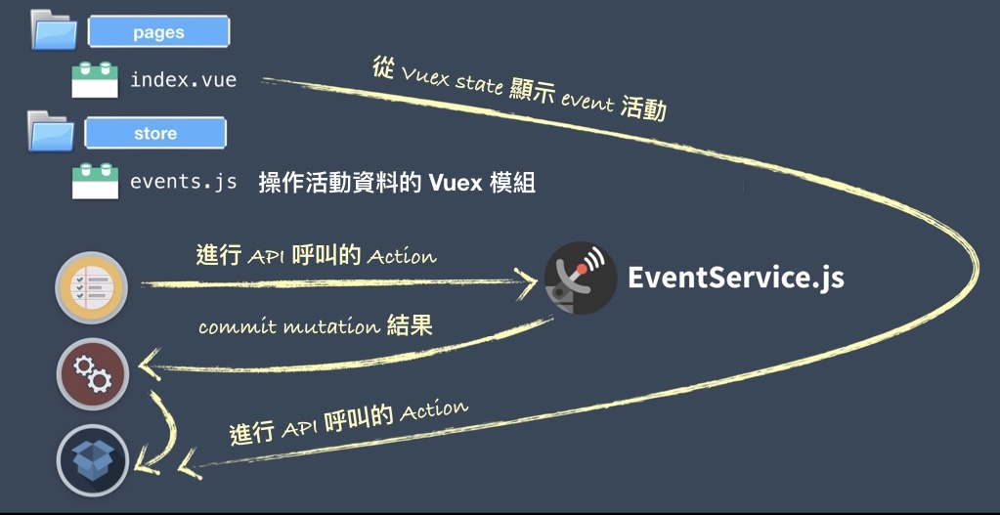
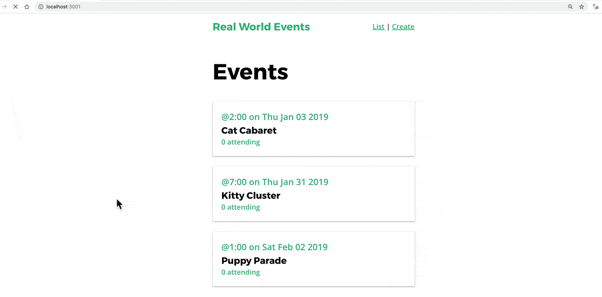
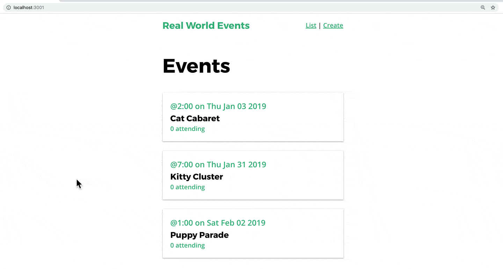

<link rel="stylesheet" href="assets/style.css" type="text/css" />
# 8. Using Vuex

在前面兩個章節中，我們學到了 Nuxt 提供了 `asyncData` hook 來讓 Axios 在組建載入前執行 server 或 client 端呼叫。你可能已經知道，在應用程式成長壯大的過程，利用 Vuex store 管理 state 會變得越來越重要。在這個章節中我們會來優化原本的程式碼，先從整理 API 呼叫，將它們集中成為一個 Service 服務，然後再為我們的 event 活動建立 Vuex 模組。

## 建立 Event Service

要建立給 Event 專用的 Service，首先我們要先來在根目錄中開一個叫做 `/services` 的資料夾，然後在裡面建立像下面這樣的新檔案

📃 **/services/EventService.js**

```javascript
import axios from 'axios'
    
    const apiClient = axios.create({
      baseURL: `http://localhost:3000`,
      withCredentials: false, 
      headers: {
        Accept: 'application/json',
        'Content-Type': 'application/json'
      }
    })
    
    export default {
      getEvents() {
        return apiClient.get('/events')
      },
      getEvent(id) {
        return apiClient.get('/events/' + id)
      }
    }
```

在這個檔案中我們設定了 Axios 並且建立了兩個 method 來呼叫 API。這兩個 method 都會回傳 promise。之後就可以很簡單的在頁面組建利用這兩個 method 取得 Event 活動資訊。

📃 **/pages/_id.vue**

```javascript
    ...
    <script>
    import EventService from '@/services/EventService.js' // <----
    
    export default {
      ...
      async asyncData({ error, params }) {
        try {
          const { data } = await EventService.getEvent(params.id)
          ...
```

在修改過後，從瀏覽器看起來應該是跟之前完全一樣，只是我們的程式碼已經修改的更加模組化了。

## 在 Nuxt 中設定你的 Vuex 來

在我們使用 `create-nuxt-app` 建立 Nuxt 應用程式腳手架時同時會建立數個資料夾。其中一個是 `store` 資料夾，這也是我們 Vuex 相關的程式碼會放置的地方。

如果 Nuxt 偵測到這個 `store` 資料夾存在時，它會自動 import Vuex 到你的專案，而且 `store` 選項也會被加入到底層 Vue 實體中。預設每個在 `store` 資料夾裡面的 `.js` 檔會轉化為帶有命名空間 namespace 的模組。

我們接著會在 `store` 目錄中建立一個 `events.js` 的 Vuex 模組。Nuxt 也會為我們建立一個命名空間為 `events` 的 Vuex 模組。而這個模組將會被用來呼叫 API 並且將 event 活動資料儲存到 state 裡面。看起來會像是下面這樣。



裡面的程式碼看起來會像是下面這樣：

📃 **/store/events.js**

```javascript
    import EventService from '@/services/EventService.js'
    export const state = () => ({
      events: []
    })
    export const mutations = {
      SET_EVENTS(state, events) {
        state.events = events
      }
    }
    export const actions = {
      fetchEvents({ commit }) {
        return EventService.getEvents().then(response => {
          commit('SET_EVENTS', response.data)
        })
      }
    }
```


這邊筆記一下，`state` 值**永遠要是一個** `function` 以避免發生不想要的 server 端分享 *state*。另一件要銘記在心的是我們必須從 `fetchEvents` action 回傳一個 *promise*。這可以幫助我們的組件知道 *promise* 什麼時候解決，這樣才能繼續載入頁面。

下一步可以利用我們 `index.vue` 組件裡面的 Vuex 模組，但我們得先學習另一個 Nuxt 給我們的頁面組件鉤子(hook）。`fetch` 頁面組件鉤子(hook)是在 client 和 server 端運作，在頁面渲染前填入 store 資料。不像 `asyncData` ，它沒有我們不再需要的合併組件資料回傳值。

📃 **/pages/index.vue**

```javascript
    <script>
    import EventCard from '@/components/EventCard.vue'
    import { mapState } from 'vuex'  // <--- To map event
    export default {
      ...
      async fetch({ store, error }) {
        try {
          await store.dispatch('events/fetchEvents')
        } catch (e) {
      ...
      },
      computed: mapState({
        events: state => state.events.events
      })
    }
    </script>
```

現在我們可以用 Vuex 來列出所有的 event 活動了。



## 為 EventShow 頁面加上 Vuex

現在我們來為另一個用來載入單一活動的頁面組件加入 Vuex。先在 **events** Vuex 模組中加入新的程式碼

📃 **/store/events.js**

```javascript
    import EventService from '@/services/EventService.js'
    export const state = () => ({
      events: [],
      event: {}
    })
    export const mutations = {
      ...
      SET_EVENT(state, event) {
        state.event = event
      }
    }
    export const actions = {
      ...
      fetchEvent({ commit }, id) {
        return EventService.getEvent(id).then(function(response) {
          commit('SET_EVENT', response.data)
        })
      }
    }
```

再來我們只要再更新 **id** 組件就好囉，順便再加入一些樣板和樣式的程式碼

📃 **/pages/event/_id.vue**

```html
    <template>
      <div>
        <div class="event-header">
          <span class="eyebrow">
            @{{ event.time }} on {{ event.date }}
          </span>
          <h1 class="title">
            {{ event.title }}
          </h1>
          <h5>Organized by {{ event.organizer ? event.organizer.name : '' }}</h5>
          <h5>Category: {{ event.category }}</h5>
        </div>
    
        <span name="map">
          <h2>Location</h2>
        </span>
    
        <address>{{ event.location }}</address>
    
        <h2>Event details</h2>
        <p>{{ event.description }}</p>
    
        <h2>
          Attendees
          <span class="badge -fill-gradient">
            {{ event.attendees ? event.attendees.length : 0 }}
          </span>
        </h2>
        <ul class="list-group">
          <li v-for="(attendee, index) in event.attendees" :key="index" class="list-item">
            <b>{{ attendee.name }}</b>
          </li>
        </ul>
      </div>
    </template>
    <script>
    import { mapState } from 'vuex'
    export default {
      ...
      async fetch({ store, params, error }) {
        try {
          await store.dispatch('event/fetchEvent', params.id)
        } catch (e) {
          error({
            statusCode: 503,
            message: 'Unable to fetch event #' + params.id
          })
        }
      },
      computed: mapState({
        event: state => state.events.event
      })
    }
    </script>
    
    <style scoped>
    .prompt-box {
      position: relative;
      overflow: hidden;
      padding: 1em;
      margin-bottom: 24px;
      transform: scaleY(1);
    }
    .prompt-box > .title {
      margin: 0 0 0.5em;
    }
    .prompt-box > .title > .meta {
      margin-left: 10px;
    }
    .prompt-box > .actions {
      display: flex;
      align-items: center;
    }
    .prompt-box > button {
      margin-right: 0.5em;
    }
    .prompt-box > button:last-of-type {
      margin-right: 0;
    }
    .location {
      margin-bottom: 0;
    }
    .location > .icon {
      margin-left: 10px;
    }
    .event-header > .title {
      margin: 0;
    }
    .list-group {
      margin: 0;
      padding: 0;
      list-style: none;
    }
    .list-group > .list-item {
      padding: 1em 0;
      border-bottom: solid 1px #e5e5e5;
    }
    </style>
```

現在我們在瀏覽活動列表和活動內容，都是使用 Vuex 囉～



## 複習

在這個章節中，我們重構了 Axios API 呼叫，把它整合到 EventService 模組裡面，然後也建立了 Events Vuex 模組來呼叫 EventService，最近利用 Nuxt 的 `fetch` 鉤子(hook)，分派 action，來取得 events 的 state。


