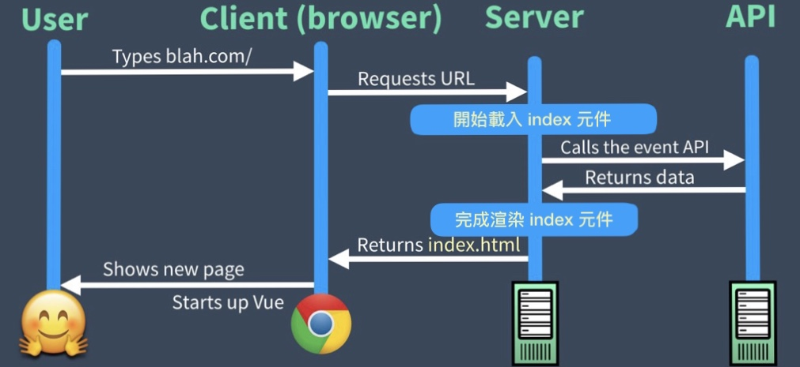
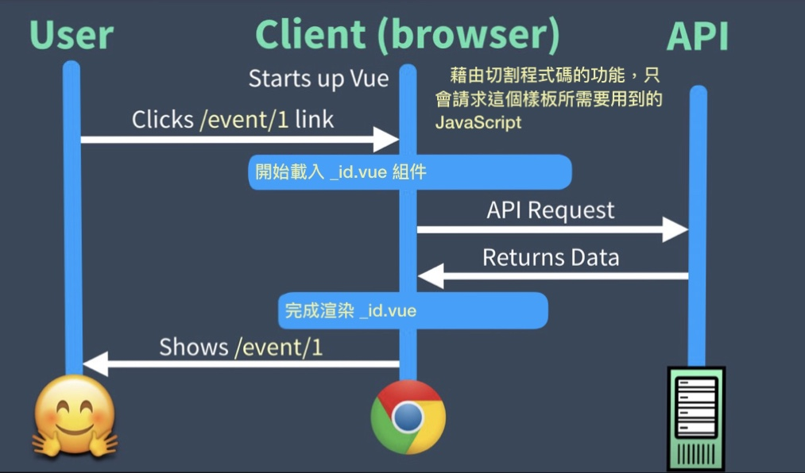
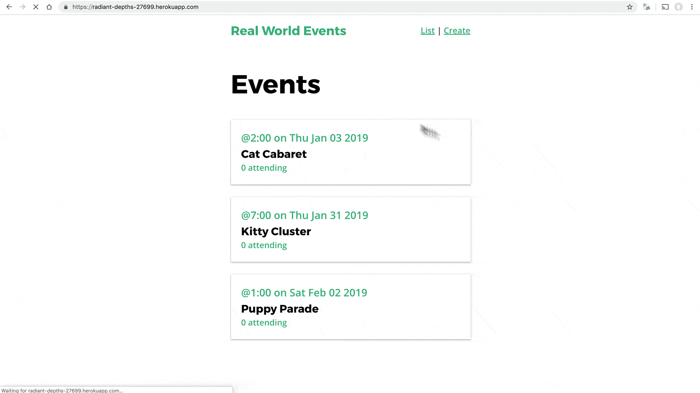

<link rel="stylesheet" href="assets/style.css" type="text/css" />
# 9. Universal 模式下的部署

直到現在，我們的程式碼都僅僅在本地段部署。但是最終我們還是必須將它們部署到 internet 上面，如此才能真正讓它發光發熱啊！所以在這個章節我們將會把 API 部署到 internet 上面，建置我們的應用程式以確保做好上線準備，並且將它以 Universal 模式部署上去。

## 喚醒你對 Universal 模式的記憶

回到[第三章-Universal Mode](3.-universal-mode.md)中，我們討論到 Nuxt 在 Universal 模式下跑的意義。為了喚醒你的記憶，我們來複習一下當應用程式放到 internet 上，我們開始對它發送 request 時看起來會像下面這張圖



這邊請注意到我們所請求的頁面是在 server 端渲染完成的(Server-Side Rendering SSR)，且渲染完成的 index.html 甚至在 Vue 啟動之前就被傳到瀏覽器端載入及顯示。一旦 Vue 啟動後，我們的應用程式就完成充水(Hydrated)而且進入一般的 SPA (Single Page Application) 模式：



這就是我們的應用程式在部署之後運作的樣子，所以首先我們要先將 API 放到雲端。

## 把 API 放到雲端

知道現在為止我們都利用 JSON-SERVER 在本地端模擬 API。但是 API 不放在 internet 的話是沒用的，所以我們必須要把 API server 放到 internet 上面。

因為這一系列的文章是為了讓我們學習 Nuxt 的，所以我們不著重在如何開發複雜且功能完善的 API，所以我們用了一個叫 [my-json-server](https://my-json-server.typicode.com/)的工具來模擬線上 API。

我們要做的就是在 github 專案中準備一個 db.json 當作 API 的資料庫。

```shell
https://github.com/my_org/my_nuxt/blob/master/db.json
```

組織就使用 my_org，而 repo 名稱就用 my_nuxt 來建立 my-json-server

```shell
  http://my-json-server.typicode.com/my_org/my_nuxt/
```

讚啦，這樣只要再把 `EventService.js` 裡面的 `baseURL` 換掉就 可以了。

📃 **/services/EventService.js**

```javascript
    import axios from 'axios'
    
    const apiClient = axios.create({
      baseURL: `https://my-json-server.typicode.com/Code-Pop/real-world-nuxt`, // <---
      ...
```

這樣我們的應用程式就算是正式呼叫在 internet 上面的 API 了！

## 建置正式環境用的應用程式

在開始部署應用程式之前，我們最好先確保我們的應用程式在本地能夠以正式模式正常運作。有以下兩個步驟。

```shell
 $ nuxt build
```

Nuxt 會建置我們的應用程式，透過在 `nuxt.config.js` 中的設定來執行 webpack，最後打包出一個適合用在正式環境上的高效率程式部署包。

在執行 `nuxt build` 之後，我們可以找到一個 `.nuxt` 的隱藏資料夾，裡面有將 Nuxt 轉出為 server 端應用程式的所有檔案。

接下來我們就來試試看將這個 Nuxt 應用程式用 node 以正式環境的模式來跑看看：

```shell
 $ nuxt start
```

這會在正式環境上啟動一個利用 `/.nuxt/dist` 資料夾產出的檔案來執行的 node 伺服器，跟開發環境伺服器不同的地方是，如果我們的程式碼有所變動的話，我們必須再重新建置和啟動伺服器。

在這個章節中，我們著重於部署應用程式。學習如何將 Nuxt 應用程式部署到 server 端，並且使用 Nuxt 提供的工具來幫助我們完成這些工作。

## 將 Nuxt 部署為 Universal 模式

Nuxt 可以被部署到任何能執行 node 的伺服器上。我們的伺服器要能夠跑以下指令

- npm install
- npm run build
- npm run start

這些是為了能有效率的安裝相依模組，使用 webpack 建置專案，並且將 node 伺服器以正式環境的模式啟動。

## 在 Heroku 上部署 Nuxt

Heroku 是少數可以完全免費部署和運行 node 伺服器的營運商之一，所以我們在這邊選擇用它來學習部署，要部署到 Heroku 有以下步驟：

1. 安裝 **Heroku-cli**，然後在 Heroku 上建立一個 app。
2. 設定 node 伺服器組態。
3. 將指令加入 **package.json**，這樣 Heroku 才知道要執行 `npm run build`
4. 加入 **Procfile**，這樣 Heroku 才知道要以： `npm run start` 啟動伺服器。
5. push 我們的 git repo 到 Heroku 來部署程式碼。

### 1. 安裝 Heroku CLI & 建立 App

我們可以參照[這邊](https://devcenter.heroku.com/articles/heroku-cli#download-and-install)的步驟來下載及安裝 Heroku CLI 工具。安裝完成後就可以使用 `heroku create`命令}

請注意，在執行完成後 Heroku 會回傳個給我們兩樣東西，第一樣是 app 的 URL，第二樣是我們之後用來 push 程式碼的 git repo 路徑，一旦 push 上去就會觸發 Heroku 部署應用程式。

### 2. 設定 node 伺服器組態

我們需要告訴 Heroku 安裝專案的 `devDependencies` (這樣才能啟動 `npm run build`)，所以我們會從命令列執行下面的命令：

```shell
 $ heroku config:set NPM_CONFIG_PRODUCTION=false
```

同樣的，我們想要我們的應用程式監聽主機 `0.0.0.0` 並且在正式環境模式執行 node：

```shell
 $ heroku config:set HOST=0.0.0.0
 $ heroku config:set NODE_ENV=production
```

### 3. 告訴 Heroku 去執行 `npm run build`

在我們完成 Heroku 的初始化安裝之後，我們需要再告訴 Heroku 從 `package.json` 檔案中，名為 `heroku-postbuild` 的特別命令執行 `npm run build`。

📃 **/package.json**

```javascript
    "scripts": {
        "dev": "nuxt",
        "build": "nuxt build",
        "start": "nuxt start",
        "generate": "nuxt generate",
        "heroku-postbuild": "npm run build" // <-----
    }
```

### 4. 加入 Procfile

接下來，Heroku 會使用一個叫做 Procfile (一個就叫做 `Procfile`，沒有副檔名的檔案) 的檔案來執行和運行我們的應用程式。`Procfile` 裡應該要包含下面的內容：

📃 **/Procfile**

```Procfile
  web: npm run start
```

這樣等於告訴 Heroku 啟動應用程式以及將外部 HTTP 流量導入我們的應用程式。

### 5. 把 git repo push 到 Heroku 來部署

最後，就像下面這樣我們可以將 git repo push 到 Heroku 上：

```shell
  $ git push heroku master
```

這樣我們的 Nuxt 應用程式就正式上線到 Heroku 上了，而且我們可以直接在 internet 上面操作，別忘了 API 也在線上了！



## 搭配 `nuxt.config.js` 客製化建置應用程式

Nuxt 和 webpack 給我們很多方法可以客製化和調整我們部署應用程式的途徑。在 `nuxt.config.js` 檔案中我們可以發現兩個值得學習的組態選項。

在裡面有個叫 `build` 的屬性可以讓我們客製化應用程式該怎麼建置的 webpack 組態。我們可以利用它來調整像是 webpack 載入器(loader) 和插件(plugin)，縮減檔案大小(minify)，檔名和輸出資料夾。其中也有個叫 `server` 的屬性，我們可以用它來為你的應用程式定義像是 port，https，socket 以及利用 timing API 的伺服器連線變數。

想要了解更多有關[build](https://nuxtjs.org/api/configuration-build/)和[server](https://nuxtjs.org/api/configuration-server#the-server-property)屬性的用法可以點擊連結到 Nuxt 文件。